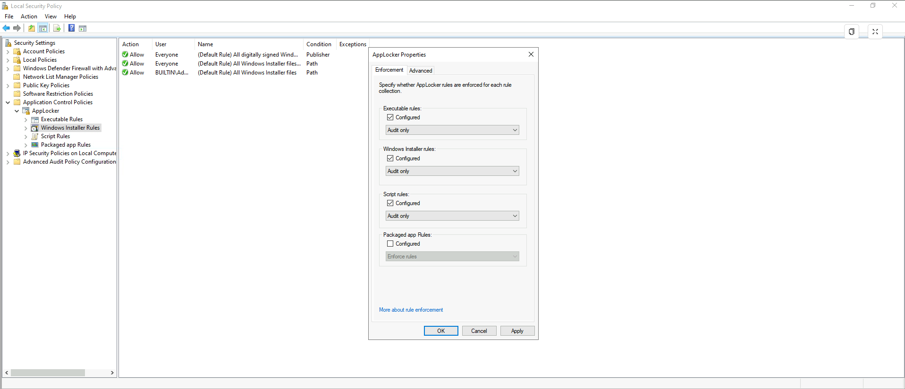
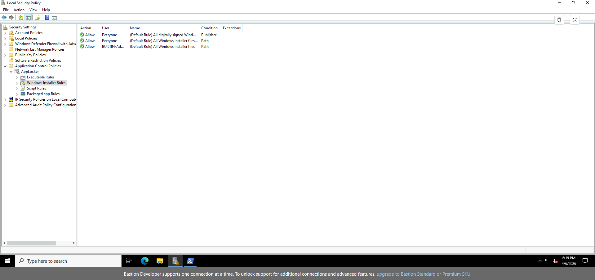
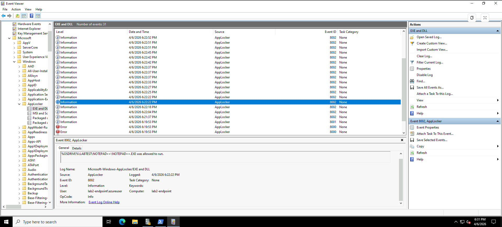

## Lab 2 – Day 1: AppLocker Setup (Audit Mode)

### Objective  
Set up AppLocker in audit mode to observe application execution behaviour without enforcing restrictions. The goal was to understand how application control policies evaluate real activity before moving into enforcement.

---

### Key Actions  

- Enabled the Application Identity service to support AppLocker policy enforcement  
- Configured AppLocker policies for:
  - Executable rules  
  - Windows Installer rules  
  - Script rules  
- Set all rule collections to **Audit only** mode to prevent system disruption  
- Created default allow rules for trusted locations:
  - Windows directory  
  - Program Files  
- Applied policy changes using `gpupdate /force`  
- Generated activity by running applications (Edge, Notepad++, PowerShell)  
- Reviewed AppLocker logs in Event Viewer  

---

### Key Observation  

During testing, application execution was observed from a non-standard directory:

C:\LABTEST\NOTEPAD++\NOTEPAD++.EXE

This location is outside typical trusted paths such as `C:\Windows\` or `C:\Program Files\`.

This highlights how legitimate applications can be executed from user-controlled or non-standard directories, which is a common technique used by attackers to bypass simple allowlisting controls.

---

### Why This Matters  

AppLocker audit mode provides visibility into application execution without impacting the system. This allows security teams to:

- Identify normal vs non-standard execution paths  
- Understand how users and processes interact with the system  
- Safely test application control policies before enforcement  
- Detect potential abuse of legitimate tools (living-off-the-land techniques)  

---

### Screenshots  

**AppLocker Audit Mode Enabled**  

**Default Rules – Executable Rules**  

**Default Rules – Windows Installer Rules**  

**AppLocker Event Logs (Execution Observed)**  

---

### Outcome  

Successfully configured AppLocker in audit mode and validated that application execution is logged without enforcement.

This provides a baseline for identifying suspicious execution patterns and prepares the environment for controlled policy enforcement in later stages of the lab.
