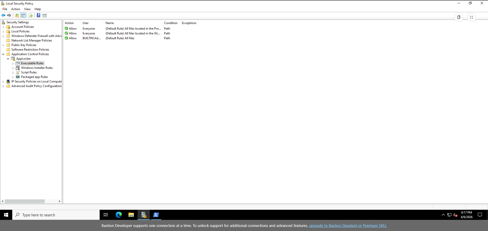

# Day 1 – AppLocker Setup & Audit Mode Configuration

## Objective

Configure AppLocker in audit mode to observe application execution 
behaviour across the endpoint without enforcing restrictions. The goal 
was to establish a logged baseline of what runs on the system before 
making any allow or block decisions in later stages.

By the end of Day 1:
- Application Identity service enabled
- AppLocker policies configured across all rule collections
- Default allow rules in place for trusted paths
- Activity generated and captured in Event Viewer logs

---

## Environment

- **VM:** lab2-endpoint (Azure, UK West)
- **OS:** Windows 10
- **Access:** Azure Bastion
- **Tool:** Local Security Policy (secpol.msc), Event Viewer, PowerShell

---

## Phase 1 – Enable the Application Identity Service

AppLocker depends on the Application Identity service to evaluate 
and log policy rules. Without it running, no events are generated 
regardless of policy configuration.

Started and set the service to automatic via PowerShell:

```powershell
Set-Service -Name AppIDSvc -StartupType Automatic
Start-Service -Name AppIDSvc
```

---

## Phase 2 – Configure AppLocker Policies

Opened Local Security Policy (`secpol.msc`) and navigated to:
```
Application Control Policies → AppLocker
```

Configured three rule collections, all set to **Audit only**:
- Executable rules
- Windows Installer rules
- Script rules

Setting all collections to audit mode prevents any execution from 
being blocked during the baseline phase — the policy observes and 
logs without interfering.


---

## Phase 3 – Create Default Allow Rules

Generated default rules for each rule collection. These cover the 
two trusted execution paths present on every Windows system:

- `%WINDIR%\*` — Windows directory and all subdirectories
- `%PROGRAMFILES%\*` — Program Files and all subdirectories
- BUILTIN\Administrators — all files (admin exemption)




Applied policy immediately:

```powershell
gpupdate /force
```

---

## Phase 4 – Generate Activity and Review Logs

Ran a series of applications to populate the AppLocker audit logs 
with real execution data:
- Microsoft Edge (from Program Files)
- PowerShell (from System32)
- Notepad++ (from `C:\LABTEST\NOTEPAD++\`)

Reviewed the resulting events in:
```
Event Viewer → Applications and Services Logs → Microsoft → Windows → AppLocker → EXE and DLL
```

All executions were logged as Event ID 8002 (allowed to run) — 
confirming audit mode was active and capturing activity correctly.


---

## Key Observation

During testing, execution was observed from a non-standard path:
```
C:\LABTEST\NOTEPAD++\NOTEPAD++.EXE
```
This location sits outside the two default trusted paths 
(`C:\Windows\` and `C:\Program Files\`). In audit mode this ran 
without issue and was logged as allowed — but under enforcement, 
without an explicit rule, it would be blocked.

> **Analyst note:** Legitimate applications installed or copied 
> outside standard directories are a common blind spot in 
> application control deployments. Attackers exploit this by 
> staging payloads in user-writable locations that don't match 
> default allow rules — a technique central to living-off-the-land 
> (LOTL) attacks. The audit baseline is what makes these paths 
> visible before enforcement decisions are made.

---

## Outcome

Successfully configured AppLocker in audit mode and validated that 
application execution is logged without enforcement. The event log 
baseline — including execution from non-standard paths — provides 
the foundation for the policy tuning and enforcement work in Day 2.

| AppLocker Event ID | Meaning | Observed |
|---|---|---|
| 8002 | Audit — allowed to run | Yes |
| 8003 | Audit — would have been blocked | No |

---

*Next: Day 2 – Policy Tuning & Controlled Enforcement*
