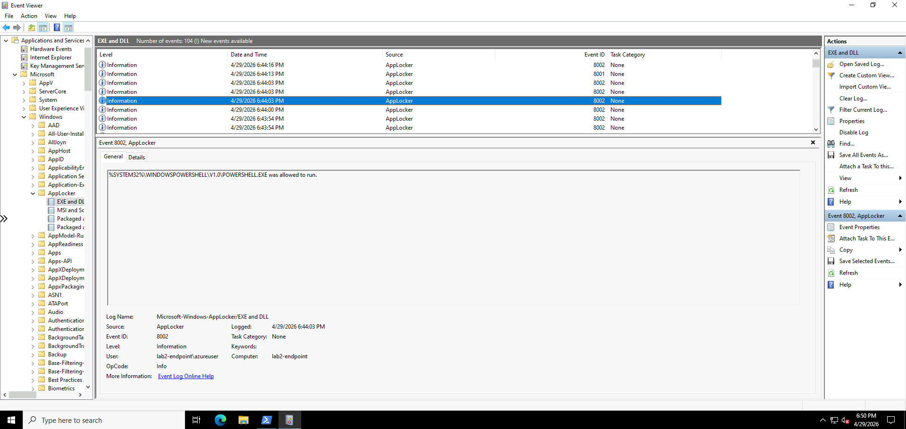
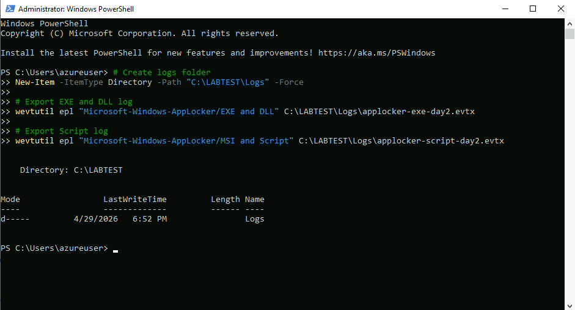
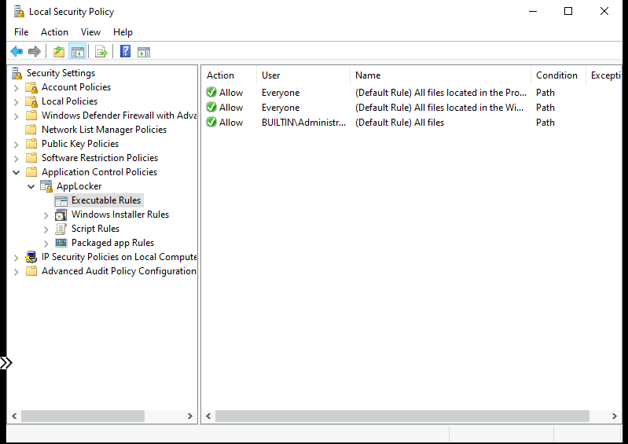
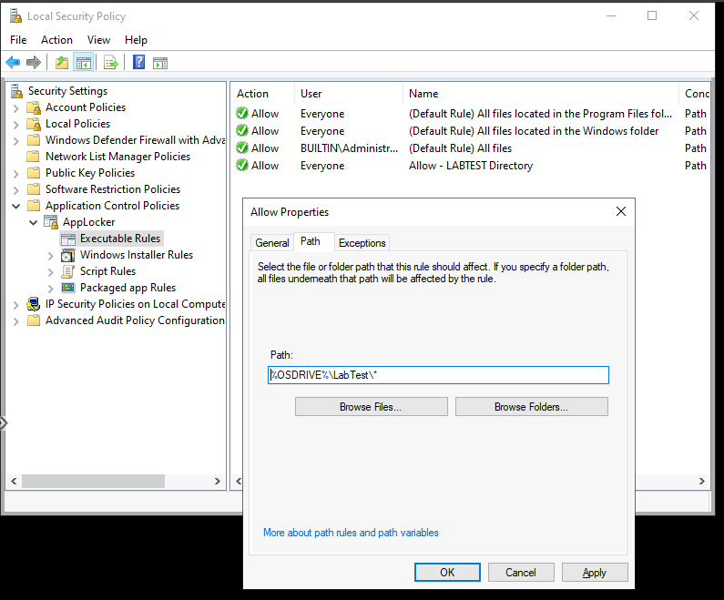
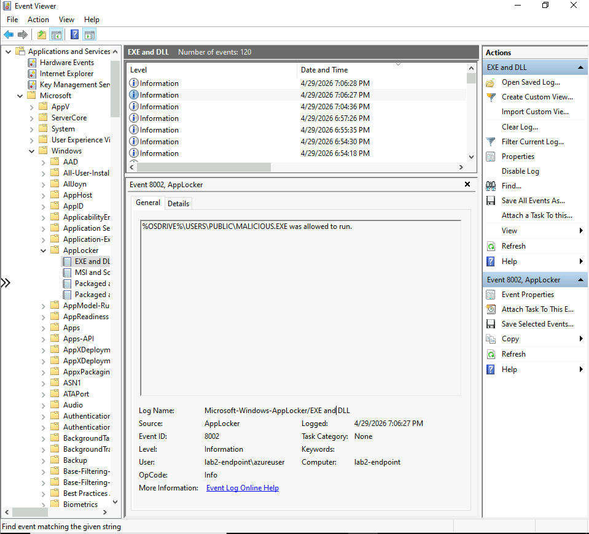
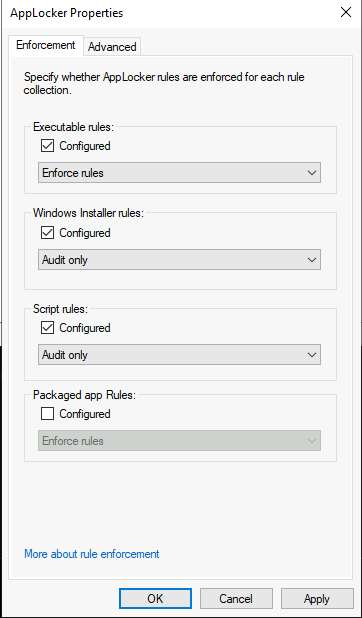
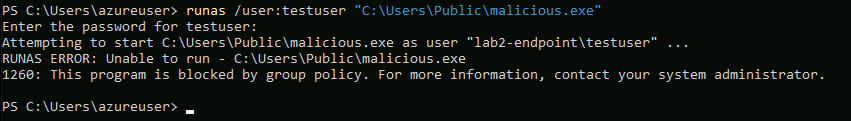
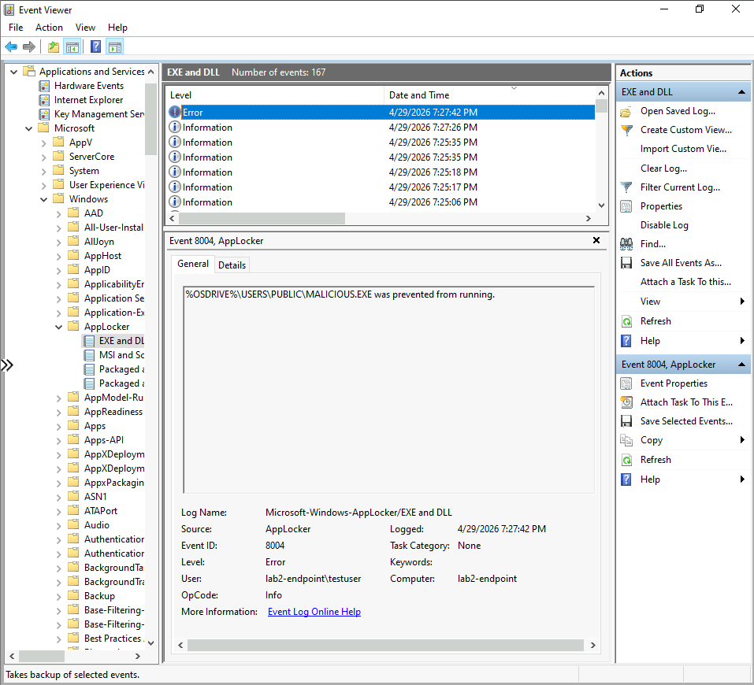
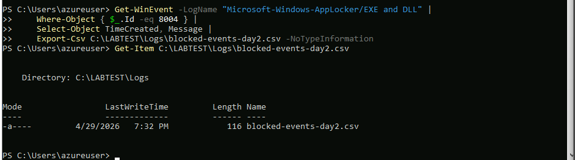

# Day 2 – AppLocker Policy Tuning & Controlled Enforcement

## Objective

Build on Day 1's audit baseline to make deliberate allow/block decisions, 
create a targeted custom rule, and safely switch executable rules to 
enforcement mode — without breaking the VM.

By the end of Day 2:
- Audit logs reviewed and categorised into analyst decision buckets
- Custom path rule created for the LABTEST directory
- Attacker behaviour simulated from a user-writable directory
- Executable rules switched to enforcement
- Block confirmed via standard user account and Event ID 8004

---

## Environment

- **VM:** lab2-endpoint (Azure, UK West)
- **OS:** Windows 10
- **Access:** Azure Bastion
- **Tool:** Local Security Policy (secpol.msc), Event Viewer, PowerShell

---

## Phase 1 – Audit Log Review

Opened Event Viewer and navigated to:
```
Applications and Services Logs → Microsoft → Windows → AppLocker → EXE and DLL
```

Reviewed 104 events logged during Day 1 activity. All events were 
Event ID 8002 (allowed to run) as AppLocker was still in audit mode.



**Key observation:** PowerShell running from 
`%SYSTEM32%\WINDOWSPOWERSHELL\V1.0\POWERSHELL.EXE` was logged as 
allowed — expected, as it runs from a trusted system path. No 
suspicious execution paths were identified from the Day 1 session.

### Analyst Categorisation

| Category | Executables Observed | Decision |
|---|---|---|
| ✅ Clearly Legitimate | Edge, PowerShell, System32 binaries | Allow via default rules |
| ⚠️ Controlled | Tooling in C:\LABTEST\ | Allow via custom rule |
| ❌ Potentially Unwanted | C:\Users\Public\malicious.exe | Block on enforcement |

---

## Phase 2 – Log Export

Exported AppLocker logs to the LABTEST\Logs directory for evidence 
retention.

```powershell
New-Item -ItemType Directory -Path "C:\LABTEST\Logs" -Force

wevtutil epl "Microsoft-Windows-AppLocker/EXE and DLL" `
    C:\LABTEST\Logs\applocker-exe-day2.evtx

wevtutil epl "Microsoft-Windows-AppLocker/MSI and Script" `
    C:\LABTEST\Logs\applocker-script-day2.evtx
```



---

## Phase 3 – Baseline Rules Review

Before creating any custom rules, reviewed the existing default 
Executable Rules in secpol.msc to confirm the pre-flight safety 
check passed.



Three default rules confirmed:
- Allow Everyone — All files in Program Files
- Allow Everyone — All files in Windows folder  
- Allow BUILTIN\Administrators — All files

Both `%WINDIR%` and `%PROGRAMFILES%` were covered, confirming it 
was safe to proceed to enforcement later without breaking the VM.

---

## Phase 4 – Custom Rule Creation

Created a targeted path rule to explicitly allow executables from 
the LABTEST directory.

**Rule type selected: Path**
- Allow
- User: Everyone
- Path: `%OSDRIVE%\LabTest\*`
- Name: Allow - LABTEST Directory



> **Rule type trade-off note:** Path rules are the most permissive 
> option — any executable placed in the allowed path by any process 
> would be permitted. In production, a publisher rule (for signed 
> software) or hash rule (for unsigned binaries) would be preferred. 
> Path rules are appropriate here as this is a controlled lab 
> directory with no untrusted write access.

---

## Phase 5 – Attacker Behaviour Simulation (Audit Mode)

Simulated execution from a user-writable directory — a common 
technique used by commodity malware to avoid paths that require 
admin write access.

```powershell
# Copy a legitimate binary to a user-writable location
Copy-Item "C:\Windows\System32\calc.exe" `
    -Destination "C:\Users\Public\malicious.exe"

# Attempt to run it
Start-Process "C:\Users\Public\malicious.exe"
```

The binary ran successfully in audit mode — expected behaviour. 
The Event Viewer logged this as Event ID 8002 (allowed to run), 
confirming audit mode was capturing the activity without blocking.



> **Analyst note:** Renaming a legitimate binary and executing it 
> from a user-writable path is a standard attacker technique. Tools 
> like Emotet and commodity RATs frequently stage payloads in 
> AppData, Temp, or Public directories to avoid paths requiring 
> elevated write access. The audit log confirms AppLocker would have 
> acted on this — the enforcement step below proves it.

---

## Phase 6 – Switching to Enforcement

After confirming the default safety rules were in place, switched 
Executable Rules from Audit to Enforce.

**Configuration applied:**
- Executable rules → **Enforce rules**
- Windows Installer rules → Audit only
- Script rules → Audit only



> **Why only Executable rules?** Enforcing all rule collections 
> simultaneously without a complete audit baseline risks blocking 
> legitimate installer or script activity. Enforcing one collection 
> at a time with a rollback plan at each stage mirrors real 
> enterprise AppLocker rollout practice.

Ran `gpupdate /force` after applying enforcement to ensure the 
policy was immediately applied across the system.

---

## Phase 7 – Enforcement Validation

### The Administrator Exemption

Initial testing as `azureuser` (local administrator) showed 
`malicious.exe` still ran. This is by design — AppLocker's default 
rule `BUILTIN\Administrators — Allow all files` means admin accounts 
are exempt from path-based blocks.

This is intentional AppLocker behaviour, not a misconfiguration. 
In production, this exemption exists so administrators can manage 
systems without being locked out by their own policies.

### Testing as a Standard User

Created a standard user account to properly validate enforcement:

```powershell
net user testuser Password123! /add
```

Then tested execution as the standard user:

```powershell
runas /user:testuser "C:\Users\Public\malicious.exe"
```

**Result:** Execution was blocked.



Error message: `1260: This program is blocked by group policy`

### Event ID 8004 Confirmed

Event Viewer confirmed the block was logged as Event ID 8004 
(enforcement block) — distinct from the 8003 audit-mode equivalent.



| Field | Value |
|---|---|
| Event ID | 8004 |
| Level | Error |
| User | lab2-endpoint\testuser |
| Message | %OSDRIVE%\USERS\PUBLIC\MALICIOUS.EXE was prevented from running |
| Time | 29/04/2026 19:27:42 |

---

## Phase 8 – Evidence Export

Exported all 8004 block events to CSV for evidence retention.

```powershell
Get-WinEvent -LogName "Microsoft-Windows-AppLocker/EXE and DLL" |
    Where-Object { $_.Id -eq 8004 } |
    Select-Object TimeCreated, Message |
    Export-Csv C:\LABTEST\Logs\blocked-events-day2.csv -NoTypeInformation

Get-Item C:\LABTEST\Logs\blocked-events-day2.csv
```



File confirmed: `blocked-events-day2.csv` — 116 bytes, written 
29/04/2026 19:32.

---

## Key Findings

| AppLocker Event ID | Meaning | Observed |
|---|---|---|
| 8001 | Enforcement — allowed | No |
| 8002 | Audit — allowed | Yes — legitimate apps and malicious.exe as admin |
| 8003 | Audit — would have been blocked | No |
| 8004 | Enforcement — blocked | Yes — malicious.exe as standard user |

---

## Security Insight

Attackers frequently execute payloads from user-writable directories 
— `AppData`, `Temp`, `Public`, `Downloads` — because these paths 
exist on every Windows system and require no elevated privileges to 
write to. Traditional AV relies on signature matching which can be 
evaded through packing or obfuscation. AppLocker's path-based 
enforcement operates independently of file content: if the binary 
isn't in a trusted path, it doesn't run regardless of what it is 
or what it's named.

This is why application whitelisting features as a Tier 1 control 
in frameworks including ACSC Essential Eight, CIS Controls v8, 
and NCSC guidance on endpoint security.

---

## Troubleshooting Notes

During this session the Azure subscription became inactive following 
a billing interruption. On reactivation, the Azure Bastion resource 
entered a failed state and required deletion and redeployment. The 
AzureBastionSubnet also had to be manually recreated in the VNet 
before Bastion could provision successfully. Additionally, a 
MicrosoftDefenderForCloud-JIT deny rule on port 3389 (priority 1000) 
was overriding the RDP allow rule (priority 1001), which was resolved 
by removing the JIT rule.

> **Analyst note:** Subscription interruptions can leave dependent 
> resources in failed states. Identifying and recovering these 
> systematically — rather than rebuilding from scratch — is a 
> practical operational skill in cloud environments.
