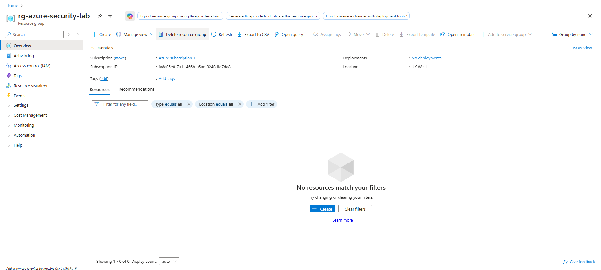

# Architecture

This section describes the architecture of the Azure security monitoring lab.

The environment is designed to simulate a simplified enterprise security stack using Microsoft Defender and Microsoft Sentinel to collect telemetry, generate detections, and investigate potential threats.

---

# Architecture Overview

The lab environment consists of a Windows Server virtual machine deployed in Azure and monitored using Microsoft Defender security services.

Telemetry generated by the endpoint is ingested into Microsoft Defender XDR and forwarded to Microsoft Sentinel through a Log Analytics Workspace, enabling security monitoring and detection engineering.

This setup mirrors a common enterprise security architecture where endpoint telemetry is centrally analysed by a SIEM platform.

---

# Core Components

The lab environment uses the following Azure and Microsoft security services:

**Azure Virtual Machine**
- Windows Server VM used to simulate endpoint activity
- Generates process, network, and security telemetry

**Microsoft Defender for Cloud**
- Provides security posture management
- Generates security recommendations and vulnerability insights

**Microsoft Defender for Endpoint**
- Collects endpoint telemetry including process execution, network activity, and user actions

**Log Analytics Workspace**
- Central data storage for security logs and telemetry

**Microsoft Sentinel**
- SIEM platform used for detection, alerting, and investigation
- Hosts analytics rules and KQL-based detections

---


# Security Telemetry Flow

The following diagram represents the flow of security telemetry within the lab environment.
```text
Azure VM
↓
Defender for Endpoint Telemetry
↓
Microsoft Defender XDR
↓
Log Analytics Workspace
↓
Microsoft Sentinel
↓
Analytics Rules / Detection Engineering
↓
SOC Investigation
```

This pipeline allows endpoint events such as PowerShell execution, network connections, and account creation to be analysed and correlated within Sentinel.

---

# Resource Group

The Azure resource group acts as the security boundary for the lab environment and contains all deployed resources.



The resource group simplifies management of the environment and ensures all security services operate within a single monitored scope.
