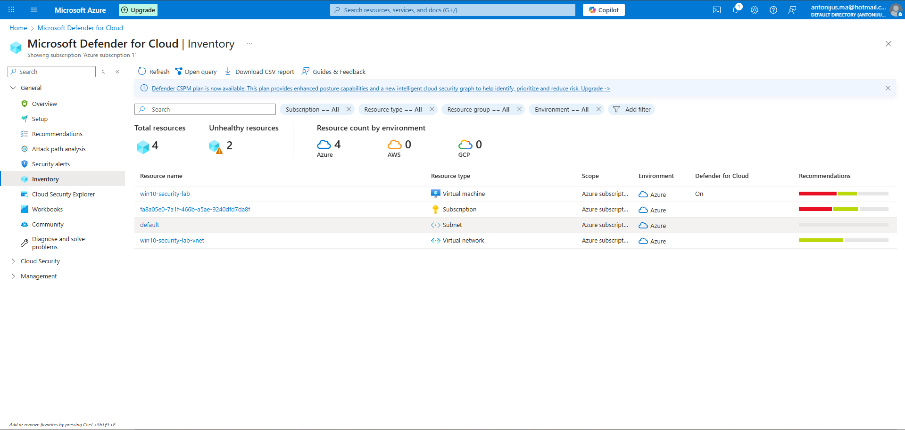

# Day 1 – Azure Defender for Cloud Setup

# Objective
Set up a basic Azure environment and onboard a Windows virtual machine into Microsoft Defender for Cloud to establish baseline security visibility.

# What was done
- Created an Azure resource group and virtual network
- Deployed a Windows Server virtual machine
- Enabled Microsoft Defender for Cloud on the subscription
- Confirmed VM onboarding and visibility in Defender for Cloud inventory
- Reviewed initial security posture and recommendations

# Evidence
### Defender for Cloud – Inventory

# Notes
- VM is intentionally minimally hardened to surface baseline security recommendations

