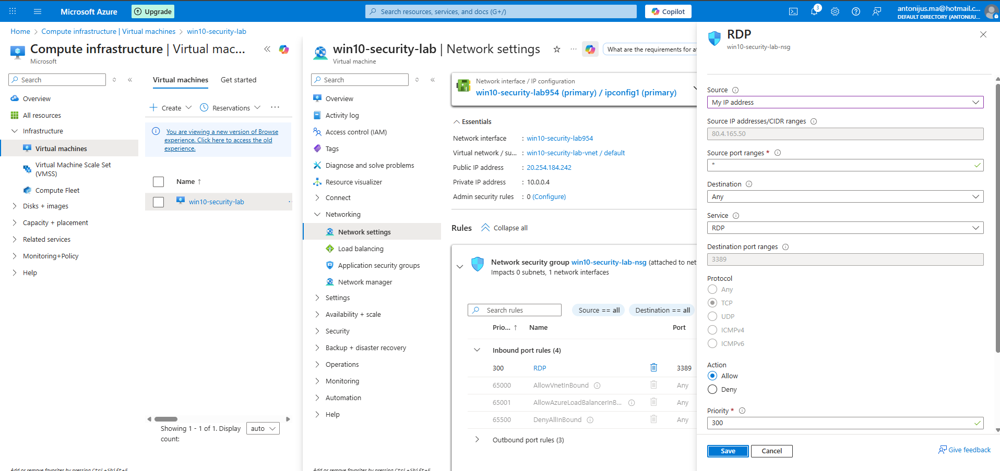
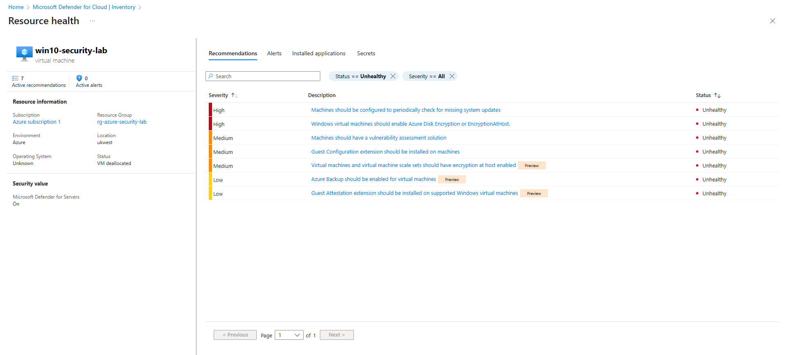

# Day 2 — Network Hardening (NSG + RDP Exposure)

## Objective
Reduce unnecessary network exposure on the VM by reviewing and tightening NSG inbound rules, aligned with Defender for Cloud recommendations.

## Initial State
- VM assigned a Public IP
- Inbound RDP (TCP/3389) allowed from any source
- Defender for Cloud flagged this as a high-severity recommendation

## Change Implemented
Restricted inbound RDP (TCP/3389) by limiting the NSG rule to my public IP address instead of allowing access from any source.

## Evidence — Before

## Evidence — After

## Defender for Cloud status

After restricting inbound RDP access to a trusted source IP, the original high-severity recommendation

**“All network ports should be restricted on network security groups associated to your virtual machine”**

was cleared.

Following remediation, Defender for Cloud re-evaluated the VM and surfaced additional, previously masked security recommendations related to patching, encryption, vulnerability assessment, and backup.

This reflects Defender’s layered posture assessment rather than a regression of the network hardening change.

## Outcome

Inbound exposure to the virtual machine was reduced by restricting RDP (TCP/3389) to a trusted source IP.

This change successfully remediated the original network exposure recommendation in Microsoft Defender for Cloud and reduced the external attack surface while maintaining administrative access.

