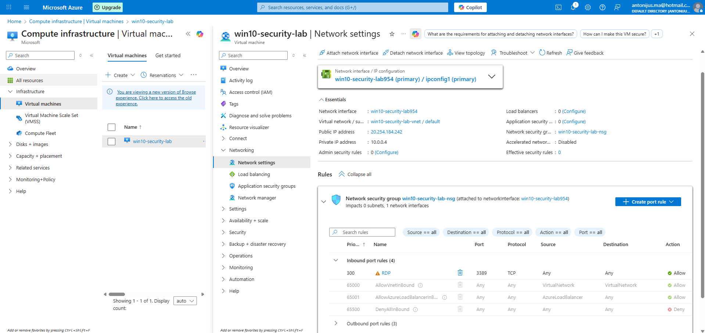

# Day 2 — Network Hardening (NSG + RDP Exposure)

## Goal
Reduce exposure of the VM by tightening inbound access (RDP/3389) and aligning with Microsoft Defender for Cloud recommendations.

## Initial state (baseline)
The virtual machine is assigned a Public IP address and allows inbound RDP (TCP/3389) from any source via a Network Security Group rule.

This configuration enables remote administration but increases exposure at the network layer, which is flagged by Defender for Cloud as a high-risk recommendation.

## Evidence — RDP exposed

## Changes applied
*To be completed*

## Outcome
*To be completed*
