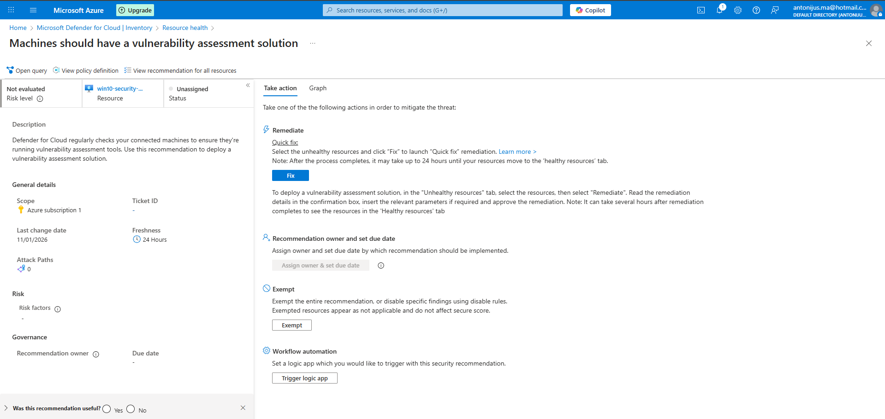
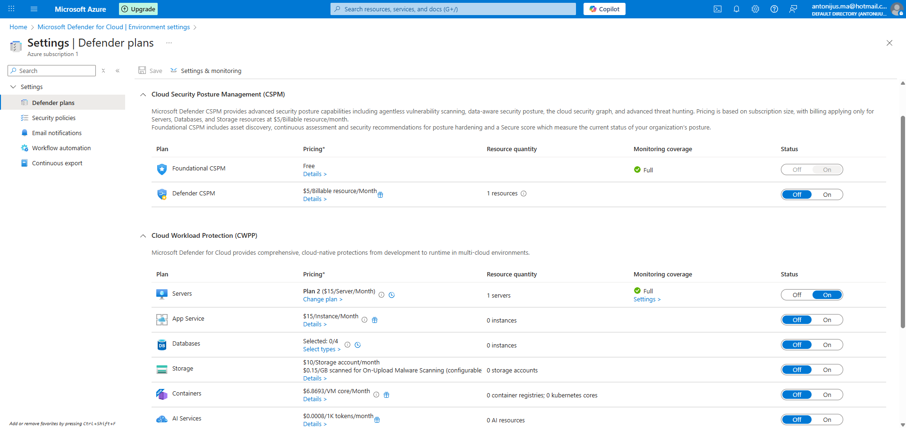
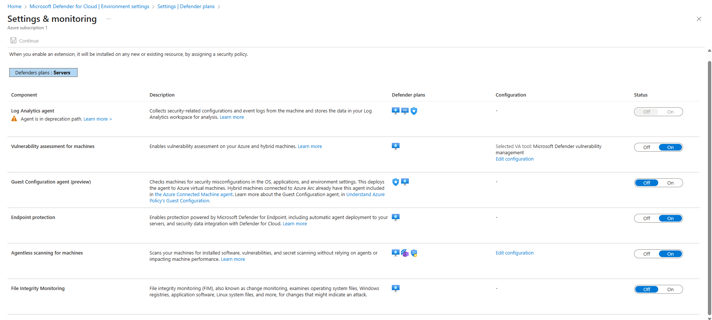
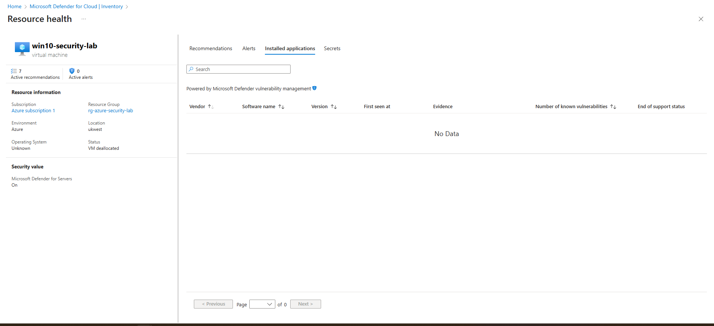

## Initial Defender for Cloud posture

At the start of Day 3, Defender for Cloud reported multiple unresolved recommendations across patching, encryption, vulnerability assessment, and backup categories.

# Day 3 — Defender for Cloud: Vulnerability Assessment Validation

## Objective
Investigate and validate Microsoft Defender for Cloud’s vulnerability
assessment coverage for the virtual machine.

## Initial Finding
After completing network hardening activities, Defender for Cloud reported
the following recommendation:

“Machines should have a vulnerability assessment solution.”

## Validation Performed
- Verified Defender for Servers Plan 2 is enabled at the subscription level
- Confirmed vulnerability assessment and agentless scanning are enabled
- Reviewed VM inventory and assessment data

## Observations
- Defender for Servers Plan 2 is active
- Vulnerability assessment is enabled
- No installed applications or vulnerability data are currently present for the VM

This indicates the VM has not yet completed its initial vulnerability scan.

## Explanation
Defender for Cloud evaluates vulnerability assessment recommendations based on
observed scan results rather than configuration state alone.

Until the first vulnerability scan completes and produces inventory data,
the recommendation remains active.

## Evidence
- Vulnerability assessment recommendation
- Defender for Servers Plan 2 enabled
- VM inventory showing no installed application data

## Outcome
Despite Defender for Servers and vulnerability assessment being enabled, no installed application or vulnerability data was observed during the initial runtime window. This is consistent with Defender for Cloud’s telemetry-driven inventory model on newly provisioned or low-activity virtual machines. The recommendation remains active until sufficient endpoint telemetry is collected.
