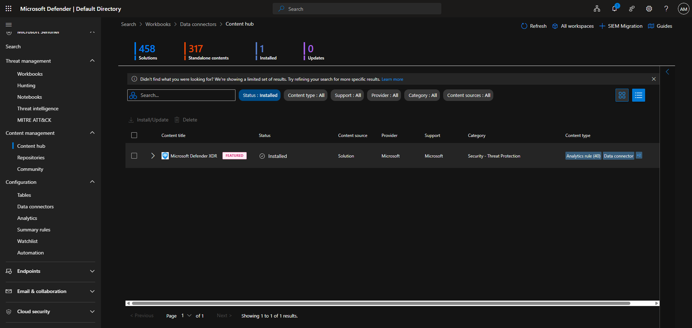
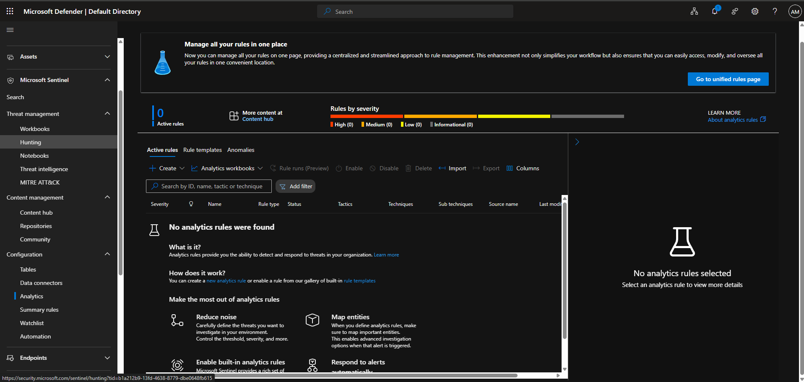
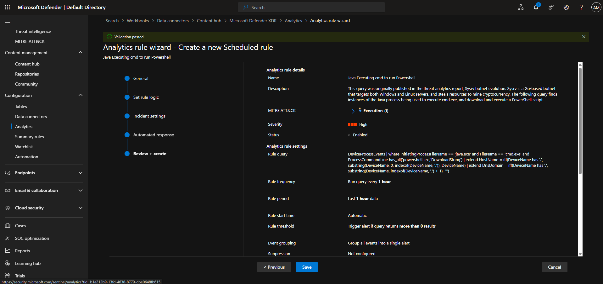
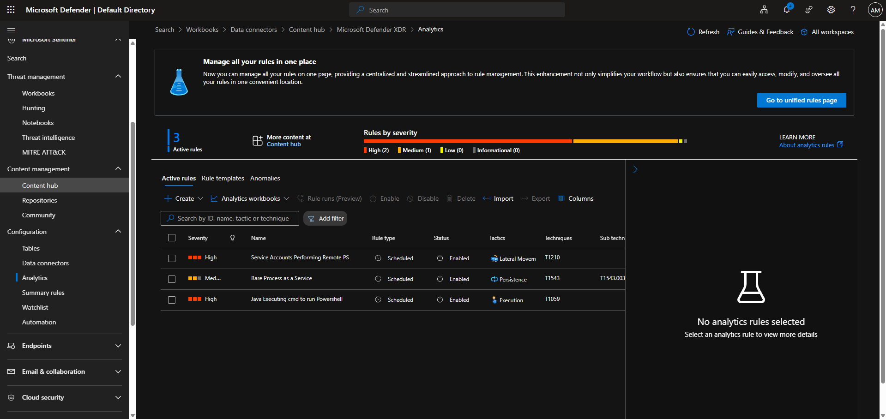
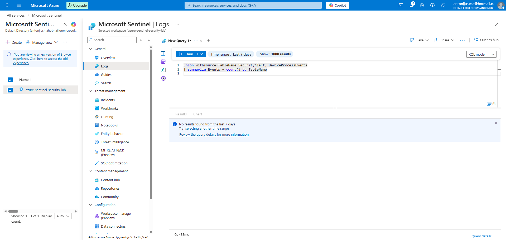

# Day 5–6 — Analytics Rule Enablement (Microsoft Defender XDR → Sentinel)

## Objective

Establish baseline detection capability in Microsoft Sentinel by installing Microsoft Defender XDR content and enabling built-in analytics rules prior to generating live telemetry.

This mirrors real-world SOC practice where detections are prepared and validated before attack simulation or production data ingestion.

---

## Environment

- SIEM: Microsoft Sentinel
- Data Source: Microsoft Defender XDR
- Workspace: azure-sentinel-security-lab
- Rule Type: Scheduled analytics rules
- Status: Enabled (no live alerts expected yet)

---

## Actions Performed

---

### 1. Installed Microsoft Defender XDR Solution

- Installed the Microsoft Defender XDR solution from the Sentinel Content Hub
- Verified successful installation and availability of analytics rule templates

**Evidence**

---

### 2. Reviewed Available Analytics Rule Templates

- Navigated to **Analytics → Rule templates**
- Reviewed execution, persistence, and lateral movement detections mapped to MITRE ATT&CK
- Selected high-signal rules suitable for baseline SOC coverage

**Evidence**

---

### 3. Enabled Built-in Analytics Rules

Enabled the following Microsoft-provided detections:

**Java Executing cmd to run PowerShell**
- Severity: High
- MITRE Tactic: Execution
- Technique: T1059

**Service Accounts Performing Remote PS**
- Severity: High
- MITRE Tactic: Lateral Movement
- Technique: T1210

**Rare Process as a Service**
- Severity: Medium
- MITRE Tactic: Persistence
- Technique: T1543

All rules were enabled as scheduled analytics rules with default thresholds.

**Evidence**

---

### 4. Verified Rule Status in Unified Rules Page

- Confirmed all enabled rules appear as **Active**
- Verified severity, MITRE mapping, and scheduled execution status
- Confirmed rules are associated with Microsoft Defender XDR telemetry

**Evidence**

---

### 5. Log Availability Validation (No Telemetry Yet)

- Queried Sentinel Logs to confirm table availability:
  - `SecurityAlert`
  - `DeviceProcessEvents`
- No results returned, as expected
- Endpoints and attack simulation not yet configured
- Confirms detection pipeline readiness rather than detection failure

**Evidence**

---

## Key Learnings & Takeaways

- Analytics rules can be enabled before telemetry ingestion
- Defender XDR content installs detection logic but does not generate alerts without:
  - Endpoint onboarding
  - Real or simulated attack activity
- Exploratory KQL querying highlighted:
  - Differences between table metadata and event fields
  - Proper usage patterns when working across multiple data sources
- This stage establishes a detection-ready SIEM, which is a prerequisite for attack simulation and alert validation

---

## Next Steps

- Onboard a Windows endpoint to Microsoft Defender for Endpoint
- Generate controlled execution activity (PowerShell / LOLBins)
- Validate alert creation and incident generation
- Perform alert triage and investigation workflow

---

## Why This Matters

This lab demonstrates:

- Correct SIEM detection lifecycle sequencing
- Realistic SOC preparation practices
- Familiarity with Microsoft Sentinel, Defender XDR, and MITRE ATT&CK
- Understanding beyond “alert chasing” into detection engineering fundamentals

