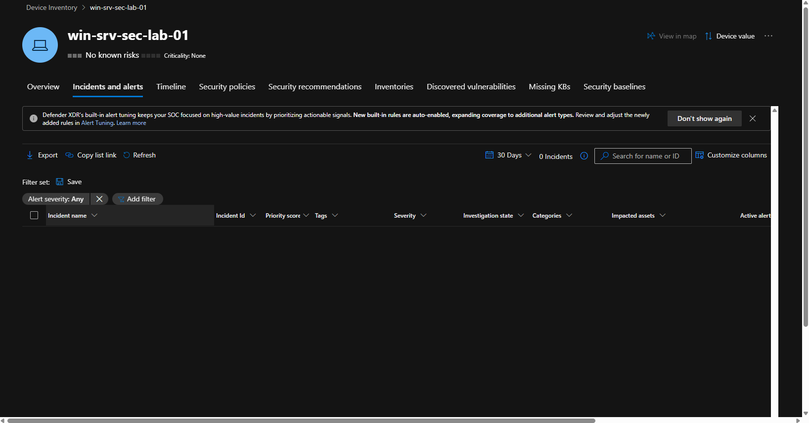
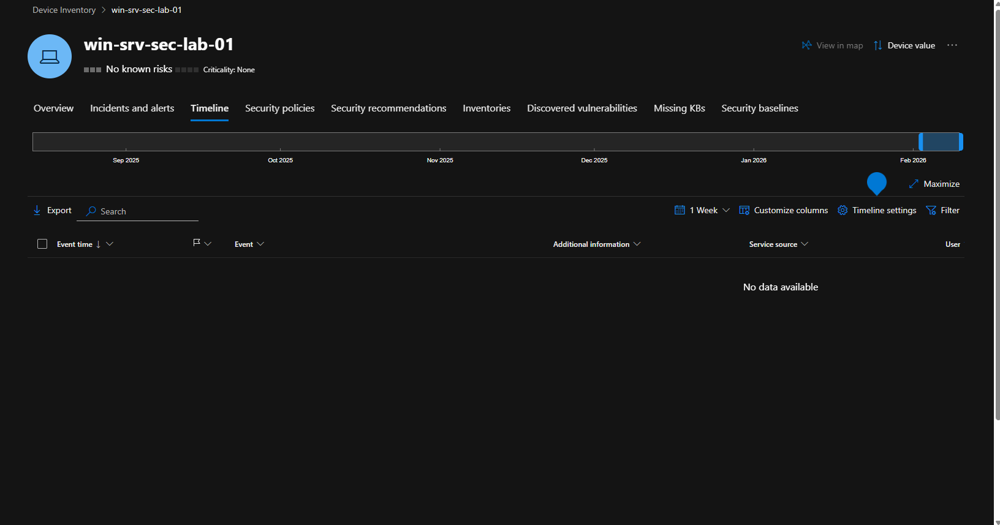
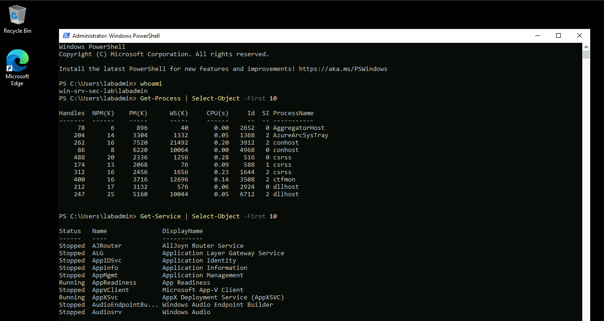
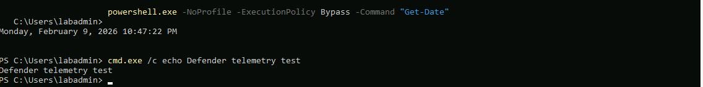
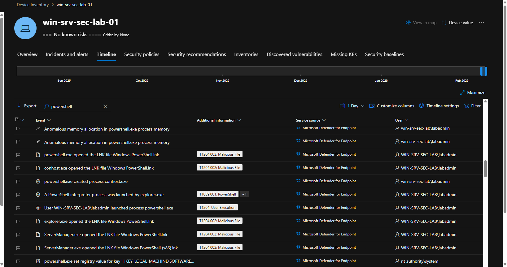
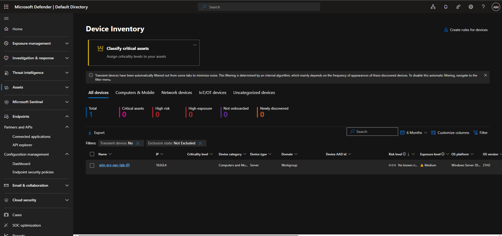
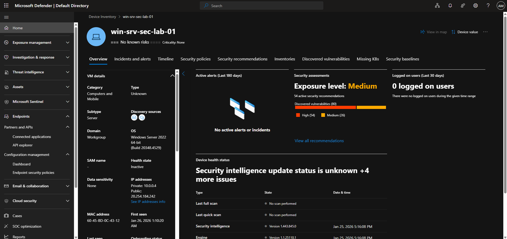
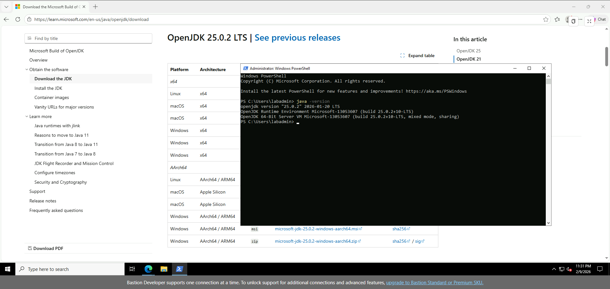
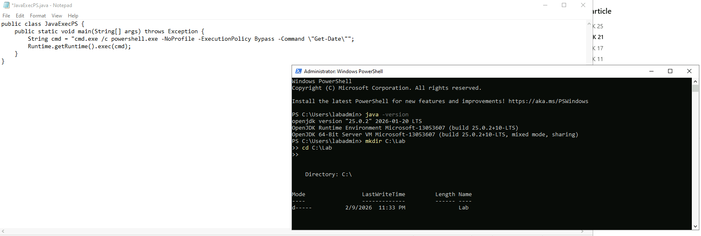
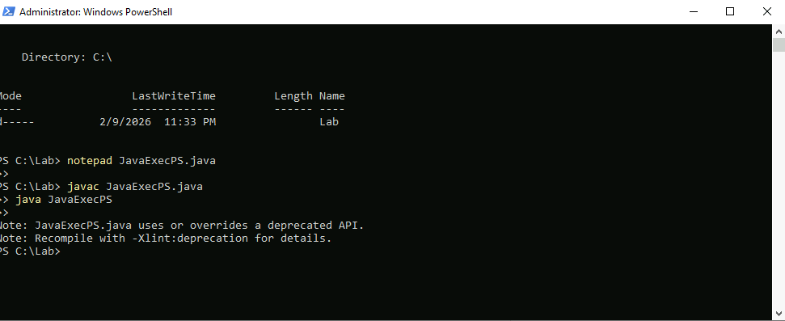

# Day 6 – Defender Telemetry vs XDR Analytics Rules

## Objective

Validate endpoint telemetry ingestion in **Microsoft Defender for Endpoint** and understand why certain endpoint behaviours do **not** result in alerts or Sentinel incidents when using **XDR analytics rule templates**.

This day focuses on confirming telemetry visibility, endpoint timeline accuracy, and analysing gaps between raw activity and alert generation.

---

## Environment

- Windows Server 2022 VM  
- Microsoft Defender for Endpoint onboarded  
- Microsoft Sentinel enabled  
- XDR analytics rule templates enabled  
- Endpoint accessed via Azure Bastion  

---

## Phase 1 – Baseline Telemetry Validation

Before attempting to trigger any alerts, the environment was validated to ensure a clean baseline state.

### No Existing Alerts or Timeline Noise

The Defender portal was checked to confirm there were no pre-existing alerts or endpoint timeline activity.

  

---

## Phase 2 – PowerShell Activity Generation

Multiple PowerShell commands were executed directly on the endpoint to generate benign but detectable activity.  
The goal was to validate:

- Process execution telemetry
- User context visibility
- Timeline population

  

---

## Phase 3 – Defender for Endpoint Timeline Validation

Following execution, the Defender device timeline successfully recorded the activity. Events included:

- `powershell.exe` execution
- Parent–child process relationships
- Associated MITRE techniques
- User context (`labadmin`)

This confirmed Defender telemetry ingestion was functioning correctly.

---

## Phase 4 – Endpoint Visibility & Asset Context

The endpoint was reviewed within Defender to confirm onboarding status, OS details, and exposure context.

  

---

## Phase 5 – Attempted XDR Analytics Rule Scenario (Java → PowerShell)

To simulate a more advanced execution chain, Java was installed with the intention of triggering a suspicious parent–child process relationship.

### Java Installation & Validation

---

### Java Program Executing PowerShell

A simple Java application was created to execute PowerShell using execution policy bypass flags.

---

### Execution Outcome

The Java application successfully launched PowerShell and executed commands at the OS level.  
However, **no Defender alert or Sentinel incident was generated**.

---

## Findings & Analysis

### What Worked

- Defender for Endpoint telemetry ingestion confirmed  
- PowerShell activity visible in device timeline  
- Parent–child process execution captured  
- Endpoint context and asset visibility validated  

### What Did Not Trigger

- No XDR analytics rule alert  
- No Sentinel incident created  

### Key Insight

> Not all suspicious-looking behaviour automatically generates alerts.  
> XDR analytics rules depend on rule logic, signal confidence, thresholds, and correlation — not just process execution alone.

This highlights the importance of:
- Validating telemetry before tuning detections  
- Iterating on analytics rule logic  
- Understanding built-in noise suppression and alert tuning  

---

## Next Steps

- Review and refine analytics rule conditions
- Validate rule logic using KQL
- Introduce more deterministic detection scenarios (e.g. encoded commands, known LOLBIN abuse)
- Correlate Defender signals into Sentinel incidents

---

