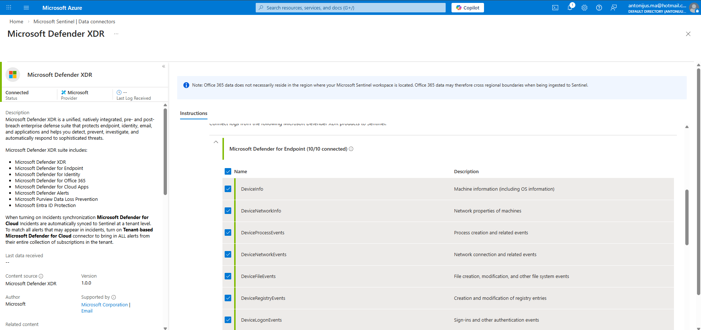
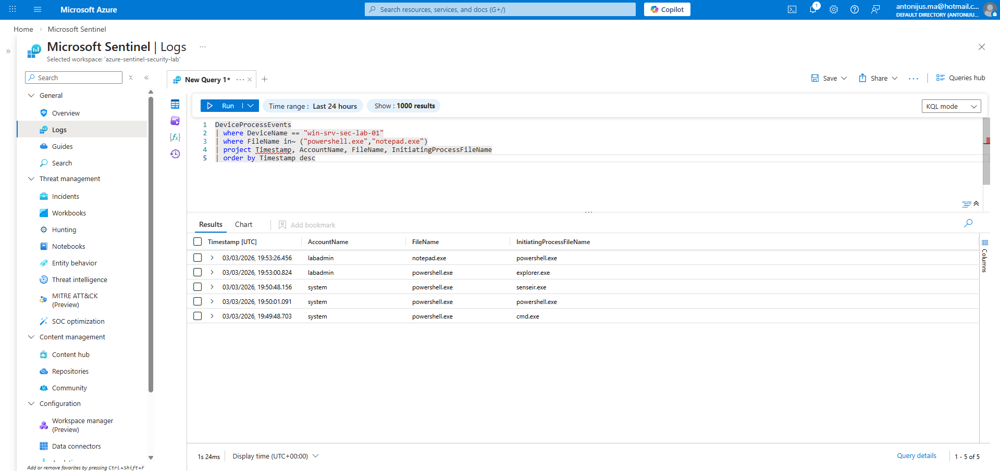
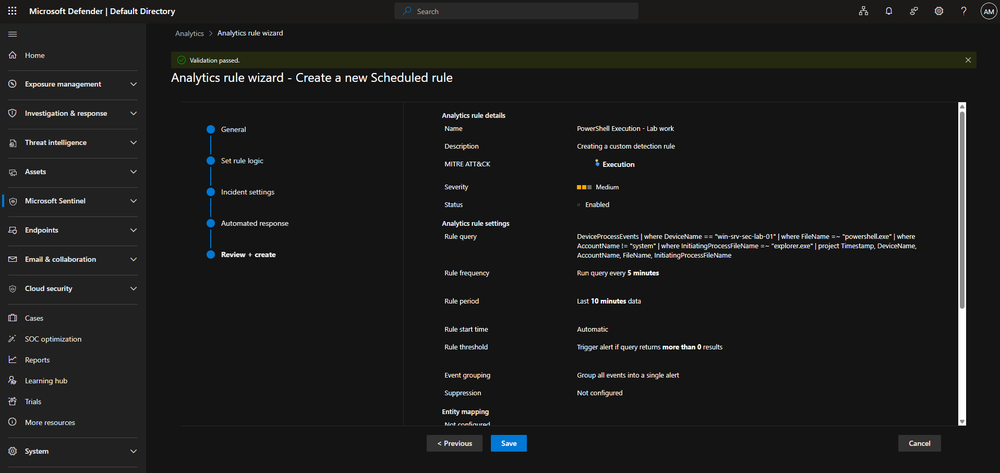
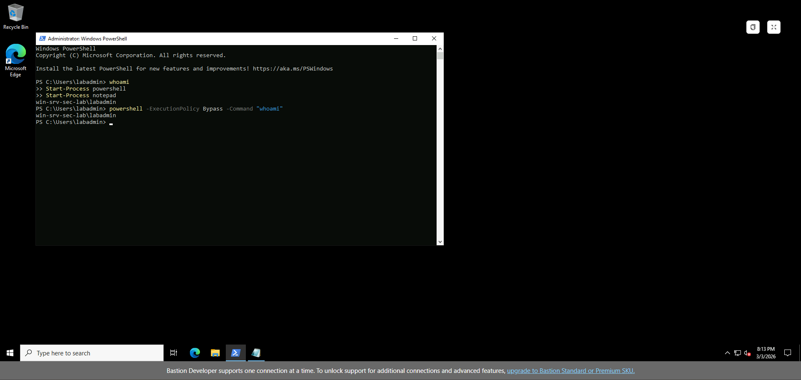
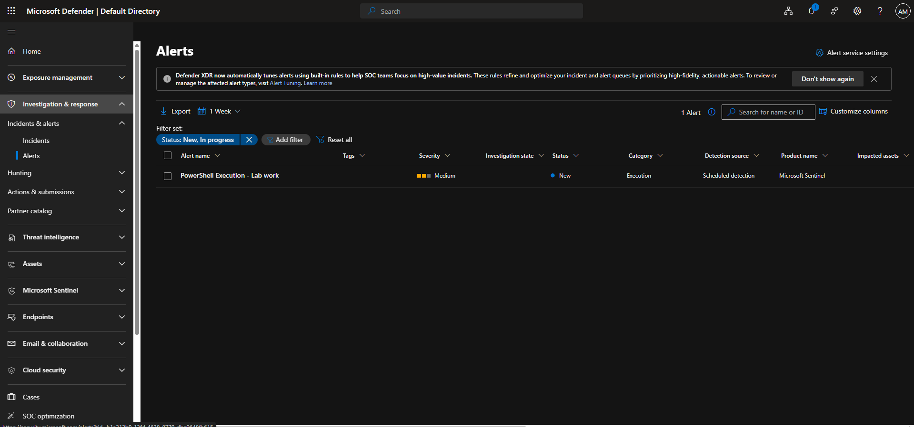
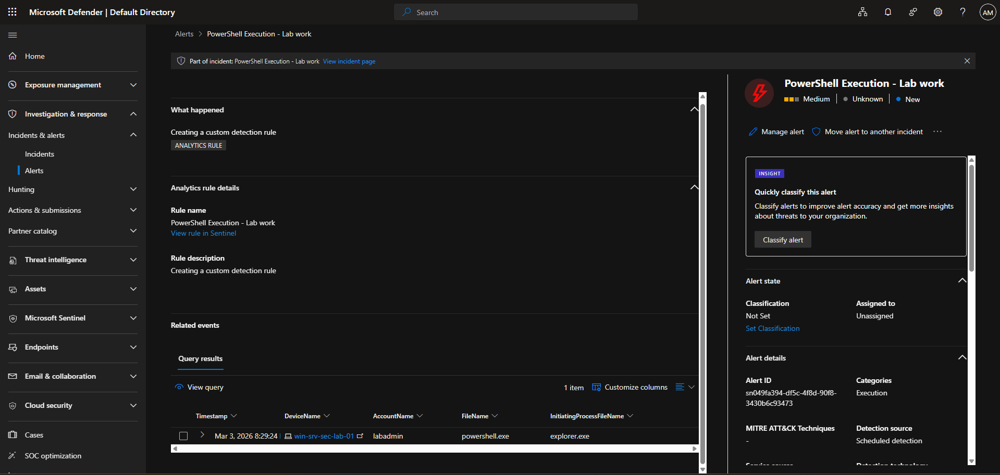

# Day 7 – Custom Detection Rule & Alert Validation

## Objective

Validate Defender XDR telemetry ingestion into Microsoft Sentinel and build a scheduled analytics rule to generate and investigate a controlled alert from endpoint activity.

---

## Phase 1 – Identifying the Ingestion Gap

Initial KQL queries against `DeviceProcessEvents` returned no results.

This indicated that although the VM was onboarded to Defender for Endpoint, advanced hunting telemetry was not yet flowing into the Sentinel workspace.

To resolve this, Microsoft Defender XDR ingestion was enabled via the Sentinel data connector.



Specifically enabled:

- DeviceProcessEvents  
- DeviceFileEvents  
- DeviceNetworkEvents  
- DeviceRegistryEvents  
- DeviceLogonEvents  

---

## Phase 2 – Telemetry Validation

After enabling ingestion, endpoint telemetry began populating in Sentinel.

Validation query used:

```kql
DeviceProcessEvents
| where DeviceName == "win-srv-sec-lab-01"
| where FileName =~ "powershell.exe"
| project Timestamp, DeviceName, AccountName, FileName, InitiatingProcessFileName
| order by Timestamp desc
```

Results confirmed:

- PowerShell execution events visible  
- Correct device name identified  
- User context (`labadmin`) captured  
- Parent-child process relationships preserved  



---

## Phase 3 – Scheduled Detection Rule Creation

With telemetry confirmed, a scheduled analytics rule was created to detect interactive PowerShell execution.

Detection logic focused on:

- Specific lab VM  
- `powershell.exe`  
- Non-system user context  
- Execution initiated via `explorer.exe`  

Rule configuration:

- Run query every: 5 minutes  
- Lookup period: Last 10 minutes  
- Trigger condition: Results > 0  
- Severity: Medium  
- Event grouping: Single alert per evaluation window  



---

### Platform Note – Unified Security Operations

Analytics rules were created within the Microsoft Defender portal rather than the classic Microsoft Sentinel blade.

This is due to the Unified Security Operations Platform onboarding model, where:

- Microsoft Sentinel and Defender XDR operate within a consolidated experience  
- Scheduled detection rules are configured centrally  
- Incidents are generated and synchronised across the unified portal  

While the interface differs from the traditional Sentinel blade, the ingestion pipeline and KQL detection logic remain unchanged.

---

## Phase 4 – Triggering the Detection

PowerShell execution was manually triggered on the VM to validate the detection.

Commands executed:

- `whoami`  
- `Start-Process powershell`  
- `Start-Process notepad`  
- `powershell -ExecutionPolicy Bypass -Command "whoami"`  



---

## Phase 5 – Alert Generation & Investigation

The scheduled rule successfully generated an alert in the unified Defender portal.



Drilling into the alert confirmed:

- Correct device: `win-srv-sec-lab-01`  
- Account: `labadmin`  
- FileName: `powershell.exe`  
- InitiatingProcessFileName: `explorer.exe`  
- Detection source: Scheduled detection  

Query results were visible within the alert context:



---

## Observations & Key Learnings

- Defender XDR ingestion must be enabled for advanced hunting tables to populate in Sentinel.
- Scheduled analytics rules evaluate historical data within the defined lookup window.
- Alerts can trigger on events that occurred prior to rule creation if still within the evaluation period.
- Event grouping prevents duplicate alerts within the same execution cycle.
- Parent-child process filtering significantly improves detection precision and reduces noise.

---

## Detection Engineering Reflection – MITRE ATT&CK Mapping

The initial rule was created without explicitly assigning a MITRE ATT&CK technique.

Although the alert categorised the activity under **Execution**, no specific technique ID was mapped during rule configuration.

For production-ready detections, this rule should be aligned to:

- **T1059.001 – Command and Scripting Interpreter: PowerShell**

Mapping detections to MITRE ATT&CK provides:

- Standardised threat categorisation  
- Improved detection coverage tracking  
- Clear alignment to adversary behaviours  
- Better reporting for SOC maturity assessments  

Future improvements would include explicitly mapping technique IDs during rule creation to ensure structured threat coverage across tactics.

---

## Outcome

This exercise validated a complete detection engineering workflow:

Endpoint activity  
→ Defender telemetry ingestion  
→ KQL validation  
→ Scheduled analytics rule  
→ Alert generation  
→ Incident investigation in unified Defender portal  

Day 7 demonstrates a full end-to-end detection lifecycle, from telemetry validation to alert triage.
