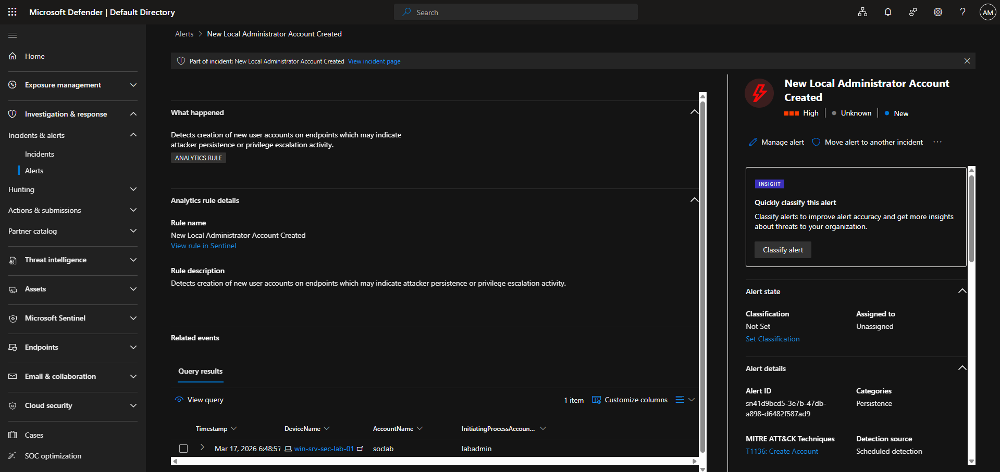
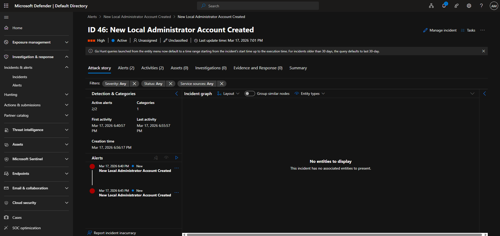
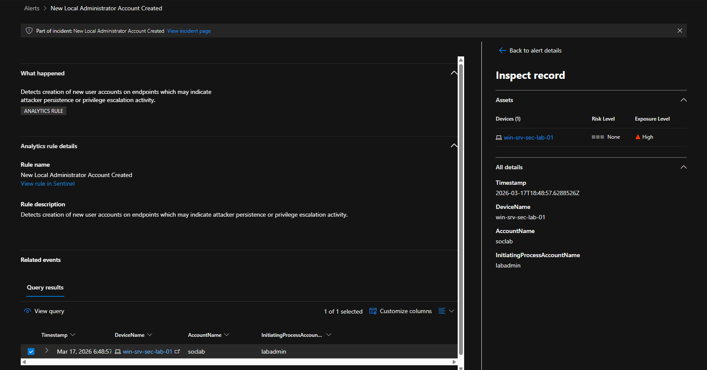
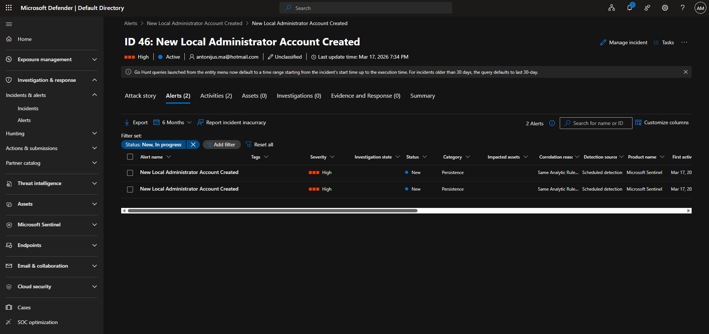
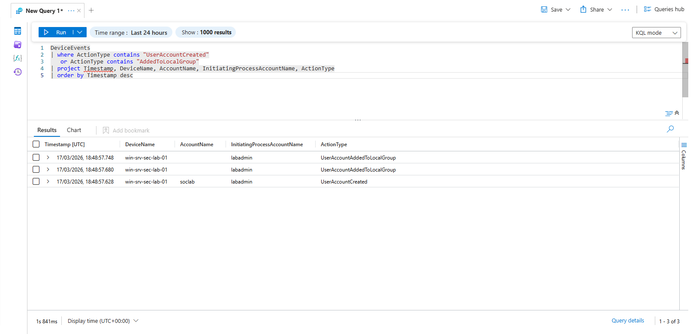
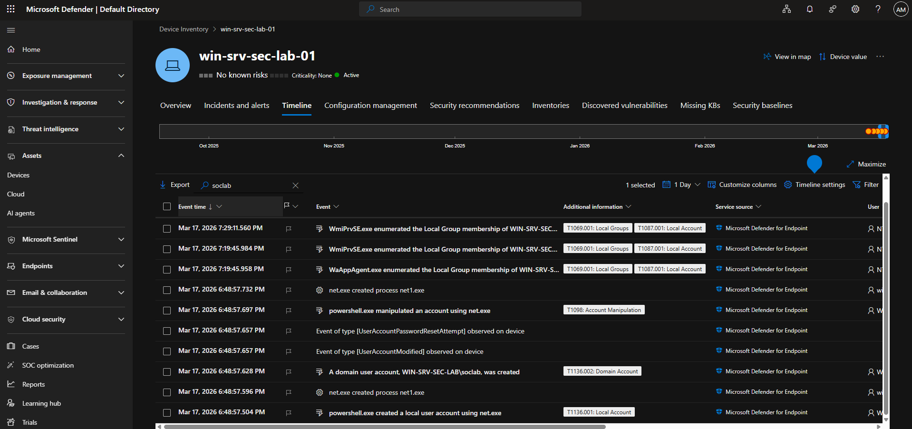
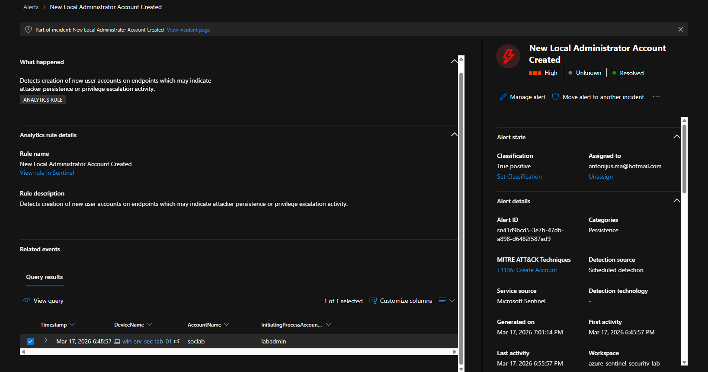

# SOC Investigation Case Study — Privilege Escalation Detection

## Objective
This case study demonstrates a full SOC investigation workflow using Microsoft Defender and Microsoft Sentinel.

The scenario focuses on detecting and analysing a privilege escalation event involving the creation of a local administrator account.

---

## Scenario Overview
A high-severity alert was generated indicating that a new local administrator account had been created on a Windows Server.

This type of activity is commonly associated with attacker persistence and privilege escalation techniques.

---

## Alert Overview

## Incident Overview

An alert was triggered indicating that a new local user account was created and added to the Administrators group on a Windows Server.

### Key Details:
- **Alert Name:** New Local Administrator Account Created
- **Severity:** High
- **Category:** Persistence
- **Device:** win-srv-sec-lab-01
- **Account Created:** soclab
- **Detection Source:** Microsoft Sentinel Analytics Rule

### Initial Assessment:
The creation of a privileged account represents a high-risk action, as it grants full control over the system.

This behaviour is commonly observed in post-compromise scenarios where attackers establish persistence.

## Initial Triage

The alert indicates that a new account was created and assigned administrative privileges.

This activity is suspicious because:
- Administrative accounts provide full system access
- Attackers frequently create accounts to maintain persistence
- This may indicate post-compromise behaviour

Key investigation questions we would look for in these situations:
- Who created the account?
- When was it created?
- Is the activity authorised?
- Were additional actions performed on the system?

##  Alert Investigation

The alert details confirm that a new account named **soclab** was created and added to the local Administrators group.

This action was performed on the device:

- **Device:** win-srv-sec-lab-01

The alert was generated based on endpoint telemetry collected by Microsoft Defender and analysed through a custom Sentinel analytics rule.

### Alert Details

## Detection Behaviour Observation

During investigation, multiple alerts were generated for the same activity.

This occurred because the analytics rule runs on a scheduled interval while querying a time window of historical data.

As a result, the same event was detected multiple times across consecutive rule executions.

This highlights the importance of:
- Alert deduplication
- Rule tuning
- Suppression logic

to reduce noise in real-world SOC environments.

## Threat Hunting (KQL Analysis)

To validate the alert, KQL queries were executed against endpoint telemetry in Microsoft Sentinel.

The query identified events showing that a new account was created and subsequently added to the local Administrators group.

### Key Findings:
- The account **soclab** was successfully created
- The account was added to the Administrators group shortly after
- The activity originated from the same device

### 📸 Query Results

## Process Analysis

I initially searched for `cmd.exe` activity in the device timeline, however this returned a large amount of normal system noise which wasn’t directly useful for the investigation.

To refine the search, I pivoted to the specific account name `soclab`, which allowed me to identify the relevant activity more clearly.

From this, I was able to observe:

- The `soclab` account being created on the device  
- PowerShell executing commands via `net.exe`  
- Account manipulation activity linked to the newly created user  

This confirms that the actions were performed using native Windows commands (`net user` and `net localgroup`), rather than any external tooling.

The process chain shows PowerShell spawning `net.exe`, which is a common way to carry out administrative actions on a system. This type of behaviour is often seen in both legitimate administration and attacker activity, so context is important when assessing it.

### Investigation Insight

Searching for generic process names such as `cmd.exe` produced significant background noise from legitimate system activity. 

Refining the search using specific indicators (e.g. account name `soclab`) allowed for precise identification of malicious behaviour.

This demonstrates the importance of filtering and pivoting during SOC investigations to isolate relevant events.

## Incident Triage & Analyst Conclusion

### Alert Classification
The alert was reviewed and classified as a **True Positive**.

The activity observed matches the actions performed during the simulation, where a new user account was created and added to the local Administrators group.

---

### Summary of Findings
- A new account `soclab` was created on the device  
- The account was added to the local Administrators group  
- Activity was executed using PowerShell and native Windows utilities (`net.exe`)  
- Detection was triggered by the custom Sentinel analytics rule  

This behaviour is consistent with a **privilege escalation technique**, where an attacker creates a new administrative account to maintain access.

---

### Impact Assessment
If this activity occurred in a real environment, it would represent a **high-risk security incident**.

An attacker with administrative access would have the ability to:
- Execute commands across the system  
- Disable or bypass security controls  
- Maintain persistence on the device  
- Move laterally within the network  

---

### Recommended Response Actions
- Disable or remove the suspicious account (`soclab`)  
- Investigate the originating user session  
- Review recent account creation and privilege escalation events  
- Check for additional persistence mechanisms on the host  
- Run a full endpoint investigation using Defender  

---

## ✅ Lab Outcome

This lab simulates a full SOC investigation workflow, from alert generation to triage and analysis.

It demonstrates the ability to:
- Validate detection rules  
- Investigate alerts using Microsoft Defender and Sentinel  
- Perform threat hunting using KQL  
- Analyse process activity on endpoints  
- Make informed security decisions based on evidence  

This reflects real-world SOC analyst responsibilities in a production environment.

